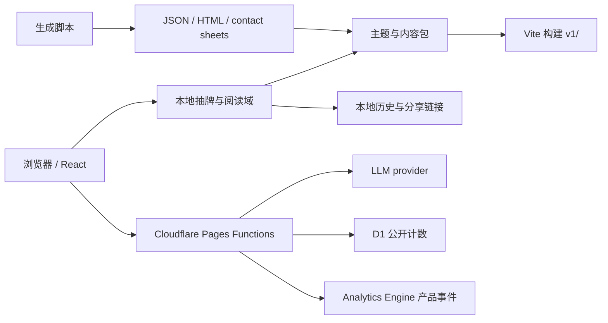

# MiaoTarot 工程手册

更新时间：2026-07-20

这是系统架构、开发、内容包、Cloudflare 运行和发布的唯一工程文档。代码与配置始终是最终事实；本页解释它们如何协作以及改变系统时必须守住的边界。

## 系统概览



原则：浏览器先在本地确定牌、顺序、正逆位和牌阵；主题只翻译内容，不改变抽牌事实；LLM 只解释结构化结果；Cloudflare Functions 持有 secrets、计数和匿名事件边界。

## 仓库结构

| 路径 | 责任 |
| --- | --- |
| `site/src/` | Vite + React UI、阅读域、主题适配器与内容包注册表 |
| `site/public/` | 路由/响应头配置和浏览器交付的 AVIF 资产 |
| `functions/` | Cloudflare Pages Functions：LLM、公开计数、产品事件 |
| `shared/` | 浏览器、Functions 和脚本共用的运行时契约 |
| `migrations/` | D1 迁移；当前 D1 只承担公开计数，旧事件表保留为迁移历史 |
| `references/` | 可编辑 PNG 母版、来源图片与机器可读 provenance manifest |
| `docs/generated/` | 可再生成的 JSON、HTML 和评审图；它们是产物，不是手写文档 |
| `scripts/` | 导出、优化、验证、测试和生产 smoke |
| `v1/` | 构建后的 Cloudflare Pages 静态输出，应随产品构建更新 |

## 前端与阅读域

`@cometpisces/tarot-kit` 提供标准 78 张数据和基础抽牌能力；`@cometpisces/tarot-kit-images` 只作为 Rider-Waite-Smith 符号参考。不要复制一套平行的牌模型或随机逻辑。

关键分层：

- `readingTypes.ts`：跨主题的阅读和牌阵契约。
- `themedTarot.ts`、`themeAdapter.ts`：把标准牌转换成主题阅读、摘要和 LLM payload。
- `themes.ts`：产品级主题元数据注册表。
- `interactiveDraw.ts`：洗牌、选择、放置、翻牌状态；选中的牌必须直接进入结果。
- `miaoContent.ts`：单牌 copy、art 与 revision 的成品边界。
- `miaoContentPacks.ts`、`miaoContentPackRegistry.ts`：内容包注册、继承和 22/78 张牌池解析。
- `readingShare.ts`、`readingHistory.ts`、`dailyReading.ts`：可还原分享、本地历史和今日主题。

交互必须保持以下不变量：

1. 同一次阅读没有重复牌。
2. 选择顺序就是牌阵位置顺序。
3. 正逆位在洗牌阶段确定，翻牌只揭示结果。
4. card back 只是皮肤，不能泄露牌面身份。
5. 一到五张牌分别映射有意义的牌阵，不使用任意无语义数量。
6. 旧分享没有内容包 id 时固定回落到 `classic-major`。

## 主题与内容包

主题决定产品语言和解释方式；内容包决定牌池、图片与卡片覆盖。两者都复用同一阅读、历史、分享和 AI 层。

新增内容包：

1. 在 `site/src/content-packs/` 新建模块并调用 `defineMiaoContentPack`。
2. 选择 `scope: 'major'` 或 `scope: 'full'`。
3. 仅换画风时用 `fallbackPackId` 继承现有内容，不复制整套数据。
4. 把浏览器图片放在 `site/public/assets/miao-packs/<pack-id>/`，PNG 母版放在 `references/miao-pack-masters/<pack-id>/`。
5. 在 `cards` 中按 Tarot id 覆盖 `breed`、`image` 或 `copy`；未覆盖字段由父包补齐。
6. 将模块加入注册表，运行 `npm run test:packs` 和 `npm run verify:launch`。

启动时注册表会拒绝重复 id、非法版本、未知牌、缺失父包和循环继承。新增包不应修改抽牌、牌阵、历史、分享或 UI 流程。

单张 Miao 卡更新时，同步检查文案、art direction、母版和线上 AVIF；有意义的视觉或语义变化要递增 `miaoContentRevisions[tarotId]`。图片生产的强制规则见 [图片生成与资产契约](image-generation-contract.md)。

## LLM 边界

生产端点是 `POST /api/readings/analyze`，实现位于 `functions/api/readings/analyze.js`：

1. 浏览器本地完成阅读并发送 `{ themeId, payload }`。
2. Function 校验 body 和 payload，在服务端重建 prompt。
3. Function 使用服务端 provider 配置调用 OpenAI-compatible API。
4. 返回 `content` 和符合 `shared/llmContract.js` 的可选 `structured` 结果。
5. 浏览器优先渲染结构化结果，失败时回退到纯文本；未配置 AI 时基础阅读仍可用。

主要环境变量：

| 变量 | 用途 |
| --- | --- |
| `LLM_API_KEY` | 必需的服务端 provider key |
| `LLM_BASE_URL` | 可选，默认 OpenAI-compatible `/v1` |
| `LLM_MODEL` | 可选模型 |
| `LLM_JSON_MODE` | 默认 `true`，要求兼容 provider 返回 JSON object |
| `LLM_MAX_TOKENS`、`LLM_TIMEOUT_MS` | 输出与超时上限 |
| `LLM_RATE_LIMIT_PER_MINUTE` | 每 isolate 的基础限流；流量增长后应迁到 durable primitive |
| `LLM_ALLOWED_ORIGINS` / `ALLOWED_ORIGINS` | CORS allowlist |
| `TURNSTILE_SECRET_KEY` | 配置后要求请求携带 Turnstile token |

浏览器不得收集或保存 provider key。Prompt 必须禁止重抽、固定预测，以及医疗、法律、财务或危机替代建议。

首轮结构化解读、有界多轮追问、Qwen 本地 smoke、最小 provider 上下文和 Cloudflare 多用户上线方案见 [LLM 交互、Prompt 与上线架构](llm-interaction.md)。

## 分享、计数与产品分析

分享层使用 `html-to-image` 生成 PNG，使用 `qrcode` 生成当前分享 URL。移动浏览器无法直接下载时，页面预览应允许长按保存。分享默认应隐藏敏感问题；加入公开 share token 后才能准确测量回流。

Cloudflare 的三类数据各司其职：

- **Web Analytics**：私有的访问量、来源、国家和趋势。
- **D1**：公开累计围观数；同一浏览器 24 小时最多贡献一次，爬虫不计数，失败时 UI 隐藏而不影响抽牌。
- **Workers Analytics Engine**：allowlist 产品事件。浏览器生成 90 天轮换匿名 id、标签页 session id 和 reading id；Function 哈希后写入事件、variant 与粗粒度产品来源。`app_opened` 每个 UTC 日每个匿名浏览器最多一次，`session_started` 每标签页一次。

产品分析不写入问题、笔记、牌面内容、原始标识、referrer URL、IP 或 MAC。浏览器本身不提供访客 MAC；IP 会受 NAT、移动网络和 VPN 影响，且属于线上标识，不用它代替用户 id。来源仅在浏览器分类为 `direct / internal / search / social / referral`，不上传域名或 URL。`MIAOTAROT_ANALYTICS` binding 由 `wrangler.jsonc` 声明，无需迁移。

Analytics Engine 数据点契约：

| 字段 | 内容 |
| --- | --- |
| `index1` | SHA-256 后的 90 天轮换匿名浏览器 id |
| `blob1` | allowlist 事件名：活跃/会话、抽牌开始/完成、每日一牌、分享、LLM 请求/成功/失败 |
| `blob2` | 事件 variant，例如牌阵 id |
| `blob3` | SHA-256 后的标签页 session id |
| `blob4` | SHA-256 后的 reading id，不适用时为空 |
| `blob5` | 粗粒度页面或来源分类 |
| `double1` | 计数值 `1` |
| `timestamp` | Analytics Engine 写入时间 |

该数据集不是传统可逐行修改的数据库；它用于聚合查询，并只保留滚动窗口内的产品事件。

完成阅读摘要与留存查询：

```bash
CLOUDFLARE_ACCOUNT_ID="..." \
CLOUDFLARE_API_TOKEN="..." \
TAROT_ANALYTICS_DAYS=7 \
npm run analytics:query

CLOUDFLARE_ACCOUNT_ID="..." \
CLOUDFLARE_API_TOKEN="..." \
npm run analytics:retention
```

`analytics:retention` 以匿名日活的首次可见日为 cohort，输出 exact-day D1 / D7 / D30。Analytics Engine 是滚动 90 天窗口，所以这是产品近期留存，不是长期用户档案。

公开计数需要名为 `MIAOTAROT_DB` 的 D1 binding：

```bash
npm run counter:db:create
npm run counter:db:migrate
```

## 本地开发

要求 Node.js、npm，以及需要本地 Pages/发布时可用的 Wrangler。

```bash
npm ci
npm run dev
```

常用命令：

| 命令 | 作用 |
| --- | --- |
| `npm run typecheck` | TypeScript 静态检查 |
| `npm run build` | 构建 `v1/` |
| `npm run test:interaction` | 选牌、顺序与正逆位 |
| `npm run test:minor` | 56 张小阿卡纳覆盖 |
| `npm run test:packs` | 内容包、继承与生成目录 |
| `npm run test:state` | 分享、历史与阅读恢复状态 |
| `npm run test:counter` / `test:events` | Functions 数据边界 |
| `npm run test:e2e` | Playwright 真实浏览器路径 |
| `npm run verify:content` | 图片、prompt、provenance 与 LLM guardrail |
| `npm run verify:pages` | 本地 Pages 路由、headers、资产和未配置 API |
| `npm run verify:launch` | 导出、类型、构建、内容、Functions、状态与 E2E 的完整发布门 |

`site/mobile-mocks/` 是不进入生产应用的三个移动交互原型。开发服务器运行时可访问 `/mobile-mocks/?variant=a|b|c`；追加 `&screen=home|question|shuffle|select|reveal|result` 可固定页面做评审。

## 移动端验证

用户界面变更不能只依赖单元测试或桌面截图。至少验证一个约 320px 的窄屏、一个代表性现代手机宽度，以及约 844×390 的低高度横屏：

- 从首页完成单牌和三牌阅读，三张牌乱序翻开后位置仍正确。
- 页面与牌堆滚动不互相困住，浏览器后退和刷新恢复符合预期。
- 触摸目标、字体、safe area、键盘和 overlay 不遮挡关键操作。
- 正逆位可辨识，最后翻牌后无需长距离滚动即可看到结果 CTA。
- 分享图片可生成、预览并在移动浏览器保存。
- 在慢网或 Functions 失败时，基础阅读仍可完成且布局不跳动。

## Cloudflare Pages 发布

生产静态目录是 `v1/`，Pages Functions 位于 `functions/`。`site/public/_redirects` 维护 `/miao/` 和 `/v1/miao/` alias；`site/public/_headers` 提供浏览器加固、API `no-store` 与静态缓存策略。默认公开 UI 不暴露 prompt、payload、标准参考图或内部研究面板；它们只在本地或 `?debug=1` 下出现。

首次配置：

```bash
npx wrangler login
npm run counter:db:create
npm run counter:db:migrate
npm run secret:llm
```

发布前后：

```bash
npm run verify:launch
npm run smoke:llm:local
npm run deploy

TAROT_PRODUCTION_ORIGIN="https://your-domain.example" npm run smoke:production
TAROT_LLM_ENDPOINT="https://your-domain.example/api/readings/analyze" npm run smoke:llm
```

`deploy` 会先运行完整发布门。`smoke:production` 检查当前构建、AVIF、Pages Functions、D1 counter、Analytics Engine 和可选 LLM；设置 `TAROT_REQUIRE_LLM=1` 可把 LLM 变为硬性条件。

发布后人工确认 `/`、`/miao/`、单牌路径、78 张牌组、分享 PNG/QR、公开计数和 AI fallback。静态响应应带安全 headers，`/api/*` 必须 `Cache-Control: no-store`。

## 依赖与授权边界

- 优先复用现有域、组件和稳定依赖；新增依赖前评估维护、license、安全、bundle、性能与移动兼容性。
- `@cometpisces/tarot-kit` 的数据与代码按其 MIT license 使用。
- `@cometpisces/tarot-kit-images` 的代码/映射为 MIT，但 Rider-Waite-Smith 图片存在 jurisdiction-specific copyright risk，只作符号参考和内部评审，不作为 MiaoTarot 品牌成品。
- 公开 GitHub 仓库不等于可复用；没有明确 license 时只参考模式。
- 第三方猫图必须经过 [图片生成与资产契约](image-generation-contract.md) 的 provenance 和授权审查。

## 文档维护规则

- `README.md` 只做入口；本页维护当前工程事实；`product.md` 维护产品判断；`image-generation-contract.md` 维护所有图片规则。
- 不新增阶段性计划、checkpoint、审计报告或试验记录 Markdown。短期过程放 issue/PR，机器结果放 JSON、HTML、图片或测试输出。
- 实现变化必须在同一提交更新对应章节和自动验证，避免文档与代码分叉。
