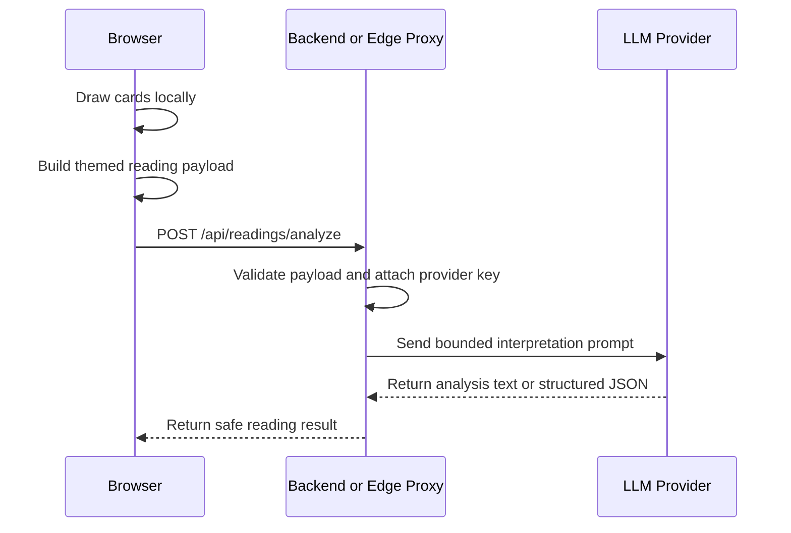

# LLM Integration Design

Date: 2026-06-22

MiaoTarot should use an LLM as an interpretation layer, not as the source of randomness or Tarot state. The app draws cards locally, builds a structured payload, then asks the model to explain that payload in the selected theme voice.

## Current Product Shape

The browser UI uses the project proxy by default and does not ask users for an endpoint, model, or API key:

1. User completes a reading in the browser.
2. The app calls `buildMiaoLlmPayload(reading)` and `buildMiaoLlmPrompt(reading)`.
3. The browser sends `{ themeId, payload }` to `/api/readings/analyze`.
4. The proxy validates the payload, rebuilds the provider prompt, attaches the server-side provider key, and calls the configured model.
5. The browser renders the structured result when the model follows the JSON contract, with a plain-text fallback.

The older OpenAI-compatible browser call path has been removed from the product code. Development and production should both use the project proxy so API keys never enter browser state.

## Production Boundary

Recommended flow:



The browser should send only the reading payload and selected theme id. The proxy owns provider keys, model selection, rate limits, and abuse controls.

## Implemented API Shape

The repository includes a Cloudflare Pages Function at:

```text
functions/api/readings/analyze.js
```

It maps to:

```text
POST /api/readings/analyze
```

Environment variables:

- `LLM_API_KEY`: required in deployment
- `LLM_BASE_URL`: optional, defaults to `https://api.openai.com/v1`
- `LLM_MODEL`: optional, defaults to `gpt-4o-mini`
- `LLM_MAX_TOKENS`: optional, defaults to `900`
- `LLM_RATE_LIMIT_PER_MINUTE`: optional, defaults to `12`; set `0` to disable the built-in per-IP guard
- `LLM_ALLOWED_ORIGINS` or `ALLOWED_ORIGINS`: optional comma-separated CORS allowlist; defaults to `*`
- `TURNSTILE_SECRET_KEY` or `CLOUDFLARE_TURNSTILE_SECRET_KEY`: optional; when set, requests must include `turnstileToken` or `CF-Turnstile-Response`

Supported theme ids:

- `miaotarot`
- `shiptarot`

Request:

```json
{
  "themeId": "miaotarot",
  "payload": {
    "task": "miaotarot_cat_meme_reading",
    "language": "zh-CN",
    "question": "我现在这股烦劲，到底是哪只猫？",
    "topic": "开放问题 / Open",
    "spread": {
      "id": "single",
      "name": "单牌聚焦",
      "sourcePattern": "轻量网页与 bot 常用的一步抽牌模式"
    },
    "cards": [
      {
        "position": "焦点",
        "role": "当下最值得看见的一件事",
        "traditional": "愚者 · 正位 · 冒险",
        "tarotCard": "愚者",
        "tarotKeyword": "冒险",
        "orientation": "正位",
        "themedOrientation": "顺毛",
        "themedName": "出门不看路猫",
        "archetype": "刚刚起步，兴奋大于规划",
        "caption": "先冲出去，路线图等会儿再说。",
        "emotionalSignal": "新鲜感、冲动、未知、轻装上阵",
        "traditionalMeaning": "新的开始。",
        "positionMeaning": "当下的观察点。",
        "topicMeaning": "开放问题语境。",
        "themedMeaning": "你正处在想开始的状态。",
        "tinyAction": "把想做的事缩成一个 15 分钟能开始的小动作。"
      }
    ]
  }
}
```

The proxy validates the payload and rebuilds the provider prompt server-side. The browser prompt preview is for local visibility only; it is not trusted by the project proxy.

Shared structured-output contract:

```text
shared/llmContract.js
```

The browser parser, Cloudflare Pages Function, local content verifier, and deployed smoke script all import this module so the `title` / `summary` / `cards` / `actions` / `shareText` JSON shape is enforced from one place.

Production guardrails currently implemented:

- actual request body size limit
- payload schema validation
- server-owned prompt construction
- per-IP in-memory rate limiting for ordinary deployments
- optional Turnstile verification
- configurable CORS allowlist
- provider output token cap

Response:

```json
{
  "themeId": "miaotarot",
  "model": "gpt-4o-mini",
  "promptSource": "server",
  "content": "模型返回的解读文本",
  "structured": null,
  "raw": {}
}
```

The current app can still accept plain text while prototyping, but structured JSON will make share cards, history, and future multi-theme rendering easier.

## Prompt Rules

The prompt should always include:

- the exact cards already drawn
- upright or reversed orientation
- spread position and role
- traditional Tarot meaning
- theme-specific meaning
- output contract
- safety boundaries

The prompt should never ask the LLM to:

- redraw cards
- predict fixed outcomes
- replace medical, legal, financial, or crisis support
- invent card facts that are not in the payload

## Provider Strategy

Keep the app provider-agnostic by using a small proxy interface:

- `LLM_PROVIDER`: provider name
- `LLM_MODEL`: default model
- `LLM_API_KEY`: server-side secret
- `LLM_BASE_URL`: optional OpenAI-compatible base URL

The browser should not know these values.

## Deploy Smoke Test

Cloudflare Pages is the production boundary:

```bash
npm run pages:dev
npm run secret:llm
npm run deploy
```

- `pages:dev` builds `v1/` and serves it with `functions/` locally.
- `secret:llm` writes `LLM_API_KEY` to the Cloudflare Pages project.
- `deploy` runs `verify:launch`, then uploads `v1/` plus Pages Functions.
- `verify:pages` starts local Pages Dev against the built `v1/` and checks redirects, launch headers, generated image serving, and the unconfigured API boundary.

For a keyless local end-to-end smoke test, run:

```bash
npm run smoke:llm:local
```

This starts a tiny OpenAI-compatible mock provider, serves `v1/` with Cloudflare Pages Dev, calls `/api/readings/analyze`, and verifies the same structured JSON contract as the deployed smoke script.

After deploying the Pages Function and setting provider env vars, run:

```bash
TAROT_LLM_ENDPOINT="https://your-domain.example/api/readings/analyze" npm run smoke:llm
```

If Turnstile is enabled for the endpoint, pass a token generated by the deployed page or a staging test harness:

```bash
TAROT_LLM_ENDPOINT="https://your-domain.example/api/readings/analyze" \
TAROT_TURNSTILE_TOKEN="..." \
npm run smoke:llm
```

The smoke script sends a small deterministic MiaoTarot payload and verifies the proxy returns non-empty `content` plus a valid `structured` JSON result. It does not read or print provider secrets.

## Next Implementation Step

The proxy now asks the model for a structured JSON result and returns both:

- `content`: the provider's text content
- `structured`: parsed JSON when the provider follows the contract

The browser also parses `content` and renders a structured card/action/share view when possible, falling back to raw text otherwise.

Local launch verification:

```bash
npm run verify:content
npm run verify:pages
npm run verify:launch
npm run smoke:llm:local
```

- `verify:content` checks all 22 Miao card image assets, image prompt coverage, generated-image mappings, and the server prompt contract guardrails.
- `verify:pages` checks Cloudflare Pages behavior locally without needing a provider key.
- `verify:launch` regenerates image prompts, typechecks, rebuilds `v1/`, then runs the content and Pages behavior gates.

Next improvements:

1. Add a visible Turnstile widget to the browser UI if the public deployment enables Turnstile.
2. Move rate limiting to a durable platform primitive if traffic grows beyond the built-in per-isolate guard.
3. Add provider-specific adapters if we use more than one LLM vendor.
