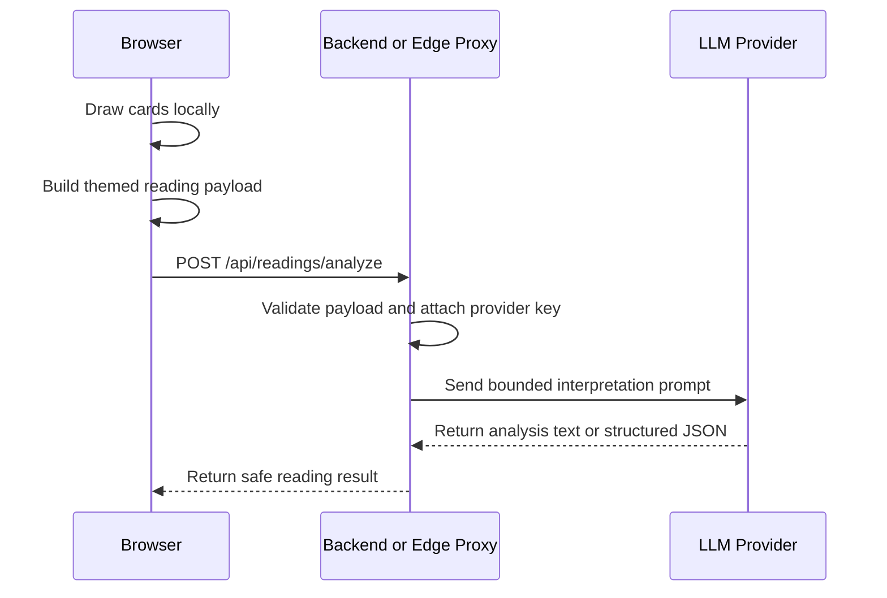

# LLM Integration Design

Date: 2026-06-22

MiaoTarot should use an LLM as an interpretation layer, not as the source of randomness or Tarot state. The app draws cards locally, builds a structured payload, then asks the model to explain that payload in the selected theme voice.

## Current Prototype

The current browser UI supports an OpenAI-compatible endpoint in the LLM tab:

1. User completes a reading in the browser.
2. The app calls `buildMiaoLlmPayload(reading)` and `buildMiaoLlmPrompt(reading)`.
3. The user can paste an endpoint, model, and optional key.
4. The browser sends a chat-style request and displays the returned text.

This is useful for local testing, but it should not be the production shape because API keys can be exposed in browser state.

## Production Boundary

Recommended flow:



The browser should send only the reading payload and selected theme id. The proxy owns provider keys, model selection, rate limits, and abuse controls.

## Suggested API Shape

Request:

```json
{
  "themeId": "miaotarot",
  "reading": {
    "question": "我现在这股烦劲，到底是哪只猫？",
    "topic": "others",
    "spread": {
      "id": "three-card",
      "name": "三牌时间流"
    },
    "cards": []
  }
}
```

Response:

```json
{
  "title": "今天是纸箱闭关猫",
  "summary": "两三句话的整体解释。",
  "cards": [
    {
      "position": "过去",
      "reading": "这一张牌怎么连接问题、牌位和主题。"
    }
  ],
  "actions": ["今天可以做的一件小事"],
  "shareText": "适合分享卡的一句话"
}
```

The current app can still accept plain text while prototyping, but structured JSON will make share cards, history, and future multi-theme rendering easier.

## Prompt Rules

The prompt should always include:

- the exact cards already drawn
- upright or reversed orientation
- spread position and role
- traditional Tarot meaning
- theme-specific meaning
- output contract
- safety boundaries

The prompt should never ask the LLM to:

- redraw cards
- predict fixed outcomes
- replace medical, legal, financial, or crisis support
- invent card facts that are not in the payload

## Provider Strategy

Keep the app provider-agnostic by using a small proxy interface:

- `LLM_PROVIDER`: provider name
- `LLM_MODEL`: default model
- `LLM_API_KEY`: server-side secret
- `LLM_BASE_URL`: optional OpenAI-compatible base URL

The browser should not know these values.

## Next Implementation Step

When we add real production calling, start with a tiny proxy instead of a full backend:

1. Add `/api/readings/analyze`.
2. Validate `themeId` against `tarotThemes`.
3. Rebuild the prompt server-side from the submitted reading payload.
4. Call the provider with server-side credentials.
5. Return a structured result that the UI can render and store.
