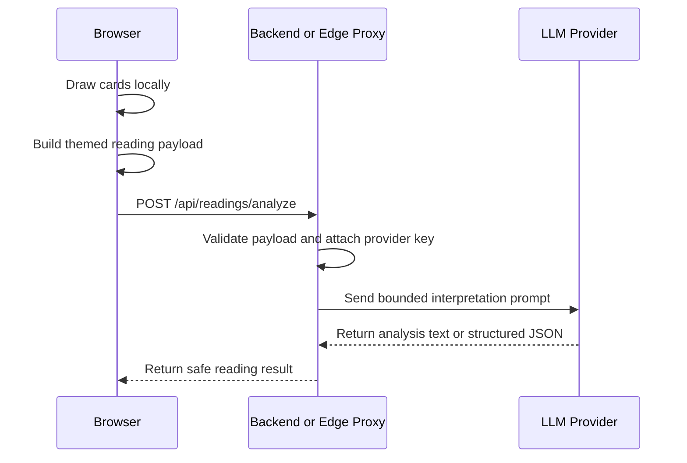

# LLM Integration Design

Date: 2026-06-22

MiaoTarot should use an LLM as an interpretation layer, not as the source of randomness or Tarot state. The app draws cards locally, builds a structured payload, then asks the model to explain that payload in the selected theme voice.

## Current Prototype

The browser UI supports both the project proxy and OpenAI-compatible endpoints in the LLM tab:

1. User completes a reading in the browser.
2. The app calls `buildMiaoLlmPayload(reading)` and `buildMiaoLlmPrompt(reading)`.
3. By default, the endpoint is `/api/readings/analyze`.
4. If the endpoint is the project proxy, the browser sends `{ themeId, payload }`.
5. If the endpoint is an OpenAI-compatible URL, the browser sends a chat-style request and displays the returned text.

OpenAI-compatible browser calls are useful for local testing, but they should not be the production shape because API keys can be exposed in browser state.

## Production Boundary

Recommended flow:



The browser should send only the reading payload and selected theme id. The proxy owns provider keys, model selection, rate limits, and abuse controls.

## Implemented API Shape

The repository includes a Cloudflare Pages Function at:

```text
functions/api/readings/analyze.js
```

It maps to:

```text
POST /api/readings/analyze
```

Environment variables:

- `LLM_API_KEY`: required in deployment
- `LLM_BASE_URL`: optional, defaults to `https://api.openai.com/v1`
- `LLM_MODEL`: optional, defaults to `gpt-4o-mini`

Supported theme ids:

- `miaotarot`
- `shiptarot`

Request:

```json
{
  "themeId": "miaotarot",
  "payload": {
    "task": "miaotarot_cat_meme_reading",
    "language": "zh-CN",
    "question": "我现在这股烦劲，到底是哪只猫？",
    "topic": "开放问题 / Open",
    "spread": {
      "id": "single",
      "name": "单牌聚焦",
      "sourcePattern": "轻量网页与 bot 常用的一步抽牌模式"
    },
    "cards": [
      {
        "position": "焦点",
        "role": "当下最值得看见的一件事",
        "traditional": "愚者 · 正位 · 冒险",
        "tarotCard": "愚者",
        "tarotKeyword": "冒险",
        "orientation": "正位",
        "themedOrientation": "顺毛",
        "themedName": "出门不看路猫",
        "archetype": "刚刚起步，兴奋大于规划",
        "caption": "先冲出去，路线图等会儿再说。",
        "emotionalSignal": "新鲜感、冲动、未知、轻装上阵",
        "traditionalMeaning": "新的开始。",
        "positionMeaning": "当下的观察点。",
        "topicMeaning": "开放问题语境。",
        "themedMeaning": "你正处在想开始的状态。",
        "tinyAction": "把想做的事缩成一个 15 分钟能开始的小动作。"
      }
    ]
  }
}
```

The proxy validates the payload and rebuilds the provider prompt server-side. The browser prompt preview is for local visibility and OpenAI-compatible development endpoints only; it is not trusted by the project proxy.

Response:

```json
{
  "themeId": "miaotarot",
  "model": "gpt-4o-mini",
  "promptSource": "server",
  "content": "模型返回的解读文本",
  "structured": null,
  "raw": {}
}
```

The current app can still accept plain text while prototyping, but structured JSON will make share cards, history, and future multi-theme rendering easier.

## Prompt Rules

The prompt should always include:

- the exact cards already drawn
- upright or reversed orientation
- spread position and role
- traditional Tarot meaning
- theme-specific meaning
- output contract
- safety boundaries

The prompt should never ask the LLM to:

- redraw cards
- predict fixed outcomes
- replace medical, legal, financial, or crisis support
- invent card facts that are not in the payload

## Provider Strategy

Keep the app provider-agnostic by using a small proxy interface:

- `LLM_PROVIDER`: provider name
- `LLM_MODEL`: default model
- `LLM_API_KEY`: server-side secret
- `LLM_BASE_URL`: optional OpenAI-compatible base URL

The browser should not know these values.

## Next Implementation Step

The proxy now asks the model for a structured JSON result and returns both:

- `content`: the provider's text content
- `structured`: parsed JSON when the provider follows the contract

The browser also parses `content` and renders a structured card/action/share view when possible, falling back to raw text otherwise.

Next improvements:

1. Add rate limiting or Turnstile if the endpoint becomes public.
2. Add a deploy-level smoke test for `/api/readings/analyze`.
3. Add provider-specific adapters if we use more than one LLM vendor.
