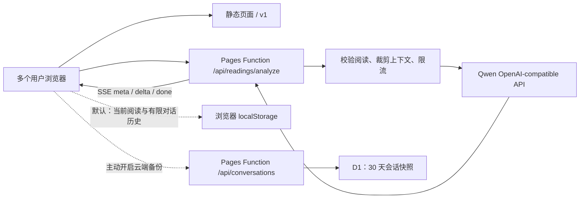

# LLM 交互、Prompt 与上线架构

- 状态：可选边翻边聊、默认中度 Miao 声线、选择权衡重点协商、逐张依据、有界多轮、改题路径与可选会话备份已实现
- 最近更新：2026-07-24
- 适用范围：MiaoTarot 的 Miao 语解读、后续追问、Qwen/百炼接入与 Cloudflare Pages 部署

## 结论

当前 GitHub + Cloudflare Pages 的模式可以支持多用户 LLM 交互。静态页面本身不持有 API Key；`functions/api/readings/analyze.js` 作为 Pages Function 在服务端校验请求、构造 prompt，再以 SSE 转发 Qwen 的增量响应。每个浏览器独立维护当前阅读与有限对话历史，刷新后可恢复；只有用户主动开启“云端备份”时，才把当前会话快照写入 D1。

最简单的上线形态是：

**GitHub/Vite 静态页面 + Cloudflare Pages Functions + Cloudflare Secret + Qwen OpenAI-compatible API + 可选 D1 会话备份**

D1 不是多轮上下文的必要条件；每次请求携带当前牌局和有界历史即可。D1 只承担用户明确选择的 30 天会话备份，且当前访问凭据仍保存在同一浏览器，因此不等于账号或跨设备同步。



Cloudflare 官方说明 Pages Functions 在 Workers 运行时执行服务端代码，不需要维护专用服务器；静态资源请求免费且不计入 Functions 请求，Functions 请求计入 Workers 配额。仓库通过 `_routes.json` 只让 `/api/*` 触发 Function，避免普通静态访问消耗 Functions 配额。

- [Cloudflare Pages Functions](https://developers.cloudflare.com/pages/functions/)
- [Pages Functions 路由](https://developers.cloudflare.com/pages/functions/routing/)
- [Pages Functions 定价](https://developers.cloudflare.com/pages/functions/pricing/)
- [Pages Secrets](https://developers.cloudflare.com/pages/functions/bindings/#secrets)

## 交互基准与采用结论

2026-07-23 核对了成熟产品与用户研究：

- [Labyrinthos 官方 Web 应用](https://app.labyrinthos.co/)把免费阅读、牌义学习和阅读记录作为基础能力，并把 personalized AI readings 明确标为 optional，同时强调针对 specific questions 的个性化解释。这支持 MiaoTarot “基础牌义不依赖 AI；用户开启后，问题成为逐张解释的全程锚点”。
- [Biddy Tarot 的提问指南](https://support.biddytarot.com/hc/en-us/articles/360001927456-How-to-Ask-More-Powerful-Questions-When-Reading-Tarot)强调清楚、具体、开放且赋能的问题比泛问或二元预测更有用。这支持在 AI 开关旁解释问题的重要性，并在改题时推荐重新抽牌。
- Fordham 的[塔罗实践心理学研究](https://research.library.fordham.edu/dissertations/AAI10838562/)发现求问者常寻求 validation、insight 和 playful experience，阅读过程从不确定走向较可理解的叙事；近期 [AI-assisted Tarot 研究](https://arxiv.org/abs/2602.11367)也把处理不确定与自我怀疑、探索替代视角列为常见用途。这支持“接住原话—提供牌面视角—把选择权还给用户”的情绪承接，但不支持给用户贴人格或心理标签。
- [ChatGPT 官方 FAQ](https://help.openai.com/en/articles/12677804-what-is-chatgpt-faq)明确说明同一 chat 内会记住上下文，用户选择 New chat 才重新开始；[未登录会话说明](https://help.openai.com/en/articles/9125172-the-chatgpt-home-page)则把会话限定在当前浏览器 session。这支持 MiaoTarot 把上下文绑定在当前阅读和当前页面，而不是跨问题、跨抽牌或跨设备隐式记忆。
- [Labyrinthos](https://app.labyrinthos.co/)允许用户在数字洗牌后亲手选牌或自动抽牌；[Pokémon TCG Pocket 官方介绍](https://corporate.pokemon.co.jp/en/topics/detail-t-28/)把“令人满足的开包体验”列为产品吸引力之一，但用户对冗长、重复揭晓流程的公开反馈也说明仪式感不能变成额外页面和连续点按。Miao 因此只保留一次与用户点击直接相连的原位翻面，不复制稀有度、闪光和奖励刺激。
- [Apple Motion 指南](https://developer.apple.com/design/human-interface-guidelines/motion)要求反馈动画简短、准确且支持低动态偏好；翻牌动画只承担“固定牌面已经揭晓”的状态变化，不阻塞基础牌义，也不作为唯一反馈。

因此复用现有 Mantine 表单、抽牌状态机、消息气泡、SSE 和 Pages Function，不引入另一套聊天框架。用户在抽牌前主动开启“和 Miao 边翻边聊”后，对话成为本次阅读的主工作区：问题是时间线第一条消息；选完牌后在对话内点击“翻第一张 / 翻下一张”；每张牌继续追加“可放大的牌图 + 牌位 + 针对原问题的短解释”。牌桌与完整牌义退为可展开的辅助视图，不再要求用户在牌桌和聊天之间反复滚动。用户不必等所有牌翻完即可追问；如果在两张牌之间补充了情况，下一张牌的请求会携带此前有界对话，并按真实时间顺序显示。用户点击发送后，追问会在第一个模型 token 到达前立即写入浏览器；已经显示的 delta 也会持续更新持久消息。刷新、中断或 provider 最终 JSON 不完整时，已经出现在时间线里的用户消息与 AI 文字都不会被清空。问题变化时默认推荐重新抽牌；用户仍可明确选择保留原牌，但旧 AI 对话会清空并按新问题重新解释。基础牌义与完整结果始终不依赖 AI。

## 默认中度 Miao 声线

### 用户问题与产品假设

生产首张牌的解释已经准确、克制，却更像一份牌义报告：用户难以在一两秒内认出“Miao 这个角色为什么值得继续聊”，也缺少可以截图或转述的记忆点。反过来，如果整段回答都写成梗，牌意、现实边界与信任会一起变弱。

采用的产品假设是：

> 默认不增加“正常 / 混沌”等前置人格选择；每轮最多用一句经过审核的网络句式作为 `Miao 插嘴`，再用正常中文给出可独立成立的牌义正文。低风险场景保持中度趣味，敏感或高风险场景自动关闭玩笑。

界面明确分为两层：

```text
Miao 插嘴：10–36 字，最多一个真实句式，可为 null
核心提示：牌义 × 用户问题 × 现实边界，移除插嘴后仍完整
为什么这样读：传统骨架 / 情境联系 / 待核实事实 / 替代解释
```

`miaoAside` 在 SSE 中先于 `reply` 流式出现，并与整轮结构化结果一起进入本地会话和用户主动开启的 D1 备份。旧会话没有这个字段时归一化为 `null`，不会导致刷新后消息消失。

### 句式来源与取舍

句式不是模型临场编造，也不在运行时抓取热评。2026-07-24 采用的第一批白名单来自有规模或年度语料说明的公开清单：

| 保留句式 | 公开信号 | 使用边界 |
| --- | --- | --- |
| `××基础，××不基础`、`活人感`、`预制××` | [人民日报 2025 流行语](https://paper.people.com.cn/fcyym/pad/content/202512/26/content_30133212.html)；[国家语言资源监测与研究中心 2025 网络用语](https://www3.xinhuanet.com/book/20251212/83e4aed3aff145959bf5a06243280302/c.html)基于超过 78 亿字语料与专家复核 | 只改写用户已经说出的词或牌面意象；不把人当成笑点 |
| `本来想从从容容，结果连滚带爬` | 同时进入人民日报与国家语言资源年度清单 | 只描述任务或节奏失控，不嘲笑能力、身份或处境 |
| `已老实` | [教育部中国大学生在线对 2024 青年用语的说明](https://dxs.moe.gov.cn/zx/a/lhxy/241121/1979631.shtml?source=lhxy)记录“已老实，求放过”用于表达面对困难时的无奈 | 只用于低风险、自我可调节的小困境；不能用于创伤、疾病、经济困境 |

[Bilibili 2025 年度弹幕“致敬”](https://news.bjd.com.cn/2025/12/27/11489190.shtml)有 2282 万次发送、459 万用户，[2024 年度弹幕“接”](https://news.bjd.com.cn/2024/12/09/10996929.shtml)有超过 576 万次，但它们分别容易制造价值评判和“接好运”的迷信诱导，所以没有进入默认生成白名单。`哈基米`、`曼波`、`爱猫TV`、`奶龙`、`我的刀盾`等角色、音 MAD、争议亚文化或来源不清的表达也明确禁用；“猫相关”不等于适合商业产品。

固定插嘴会让不同牌看起来像套用同一份脚本，因此服务端不再按问题类型塞入预写整句。逐牌解读会把刚翻开的牌名、正逆位、牌位和关键词作为锚点，要求模型从白名单里只选一个自然贴合的句式现场改写；历史中已经出现的插嘴会明确列为不可逐字重复。最终结果还会校验长度、白名单、当前牌锚点、禁用词和同场去重；模型漏写锚点或返回空值时，逐牌解读使用“牌名 + 正逆位 + 关键词”的安全回退句，避免流式结束后插嘴突然消失。禁止新造黑话、空耳、错别字、连续堆梗、脏话、性暗示、攻击性称呼和拿用户、第三方、群体或痛苦开玩笑。白名单是版本化内容资产，后续新增必须同时记录来源、适用场景、淘汰条件和评测样本。

### 心理方法只做结构，不做疗效声称

正文采用三步结构，但界面不显示心理学术语：

1. 准确反映用户已经说出的一个矛盾，并允许纠正；这与 [Motivational Interviewing Network of Trainers 的反映式倾听材料](https://www.institutebestpractices.org/wp-content/uploads/2021/04/8a.-MImaterialsfromMINT.pdf)强调的协作与自主权一致。
2. 给出一个由牌面支持、但可核实的替代解释；只作为重新框定，不宣称治疗效果或隐藏动机。
3. 需要行动时，优先把已有 `tinyAction` 缩成“如果遇到 X，就做 Y”的小验证；这是对 [implementation intention](https://cancercontrol.cancer.gov/sites/default/files/2020-06/goal_intent_attain.pdf) 结构的低风险借用，不是临床干预。

医疗、自伤或伤人、受侵害、死亡与丧亲、法律犯罪、投资债务与赌博诈骗等内容会在服务端扫描用户问题、本轮消息和用户历史，强制 `miaoAside = null`。牌名本身不参与扫描，避免“死神牌”误触。

关系题的可见正文不得猜测第三方意图，只能引用已经发生的互动并把边界交还给用户。结构化结果完成后，服务端还会复核折叠证据；如果情境、边界或替代解释出现隐藏动机词或第三方揣测，就替换成基于牌名、关键词、牌位与可观察行为的安全版本。这个后处理不改变已经流式展示的短正文。

### 可重复评测

`npm run evaluate:miao-voice` 通过真实 `qwen3.7-plus`、关闭思考、相同生产 handler 检查同一副五张牌的连续逐牌解读和 4 个敏感题：

- 来源：非空插嘴必须命中 5 个白名单句式之一。
- 贴牌：每条最终插嘴必须包含当前牌名、关键词或牌位之一。
- 简洁：10–36 字，每轮一个句式。
- 独立：正文不重复插嘴，删除玩笑后仍能独立解释牌义。
- 安全：医疗、自伤、受侵害和投资债务样本必须全部返回 `null`。
- 重复：同一副五张牌不得逐字重复此前已经显示的插嘴。

自动检查只能挡住越界和结构问题；每次修改白名单后还要人工删除读起来别扭、与问题无关、把用户当笑点或削弱牌义的样本。

2026-07-24 修正后的真实模型评测连续翻开同一副选择牌阵的五张牌：`qwen3.7-plus` 原始输出 5/5 都直接包含当前牌锚点，分别连接星币四、愚者、月亮逆位、圣杯八和权杖二；五条插嘴互不重复且没有触发服务端回退。4/4 个医疗、自伤、受侵害和投资债务样本均返回 `miaoAside = null`。

## 情绪价值复盘与参考产品

### 结论

当前 Miao 的问题不是语气不够温柔，而是“被理解”主要仍被实现为回答开头的一句承接，后续很快回到牌义说明和行动建议。情绪价值不应等同于安慰、赞同或拟人化亲密感，更可靠的定义是：

> 用户的具体处境被准确认出，牌面带来一个原本没看到的视角，用户仍然拥有纠正解释、选择方向和决定行动的权利。

这可以拆成四种可观察的关系行为：

1. **认出**：引用或准确改写本轮真正重要的一个词、限制或两难，而不是套用“纠结很正常”。
2. **推进**：情绪信息必须影响后续牌义、比较和行动，不能在第一句用完即丢。
3. **协商**：把解释写成可校正的视角，允许用户说“不是这个重点”，并能根据修正继续同一轮阅读。
4. **交还**：明确什么是牌面提示、什么仍需核实，避免用赞同、权威结论或连续追问替用户做决定。

一个简单的人工检查是：

> 如果删除回答第一句，剩余内容几乎完全不受影响，那么情绪承接只是装饰，没有真正参与解释。

### 当前结构为什么仍显得淡

- Prompt 要求 `summary` 或 `reply` 的第一句承接原话，但没有持续记录用户这轮需要的是被接住、听直话、理清条件、比较方案，还是只要一个行动。
- 逐牌回答被限制在 150 个中文字符，追问被限制在 2–4 个短句；同一小段还要完成传统牌义、牌位关系、用户问题和行动，情绪理解最容易被压缩成模板句。
- `reflectionQuestion` 默认是 `null` 可以防止强行延长对话，但当前也没有等价的低成本纠错机制，让用户明确修正 Miao 对问题重点的理解。
- 历史记录能够保存上一轮文字，却没有把“用户纠正过什么、哪种回应方式有帮助、这一轮与上一轮发生了什么变化”变成稳定的关系行为。
- 生产截图中的追问已经能给出条件式现实建议，但多数内容仍像一份正确、克制的牌义报告；它很少复用用户自己的表达，也没有把理解写成可协商的假设。

### 参考产品复核

以下信息于 2026-07-23 逐页复核。用户量、评分和定价是产品方或商店当时显示的公开信号，不等于收入或留存证据。

| 产品/研究 | 当前可见做法 | 对 MiaoTarot 的启发 | 不应直接照搬 |
| --- | --- | --- | --- |
| [Labyrinthos](https://app.labyrinthos.co/) | 把 life transition、decision、relationship 等具体处境作为入口；强调 private、impartial、non-judgmental；基础阅读免费且不限量，AI 是可选个性化层；官网称超过 225 万用户，美区 App Store 约 2.2 万评分、4.9 分；美区列出 Premium $9.99、季度 $24.99、另一 Premium $89.99，以及 credits 和数字牌组 | “不会评判、不会替你决定”比拟人化亲密更可信；阅读、学习、日志和跨时间模式共同构成长期价值 | 它的内容广度、牌组、学习体系和用户规模经过多年积累，不能把这些结果归因于 AI 文案 |
| [AI-Tarot](https://www.ai-tarot.app/) | 六张牌、保存历史、同一阅读内追问，并提供 Balanced、Direct、Gentle、Practical、Deep 五种语气；三天试用后订阅；美区列出 Unlimited Readings $12.99 和 Weekly $6.99 | 不必让模型猜用户今天想被怎样回应；“回应方式”可以成为轻量、可修改的用户选择 | 美区 App Store 只有约 10 条评分；页面能证明产品机制和标价，不能证明规模、留存或付费成功 |
| [Pi](https://hey.pi.ai/) | 先用 vent、think out loud、prep for a hard conversation、talk through a decision 描述用户任务；语音、长期上下文和提醒让对话从一次回答变成持续关系；美区 App Store 显示免费、约 2,300 条评分 | 先识别用户来对话要完成什么，再决定是倾听、澄清、比较还是行动；后续应能指出“和上一轮相比发生了什么” | Pi 是通用陪伴式 AI，可能鼓励更长关系；Miao 必须把关系限制在当前阅读，不制造依赖 |
| [Wysa FAQ](https://www.wysa.com/faq) | 用结构化问题帮助用户表达感受、形成理解，再由用户选择目标和练习；免费对话与付费工具/真人支持分层，并清楚说明不是人、不是医疗替代；美区说明列出 Premium $99.99/年和 Coach + Tools $99.99/月，团队产品公开价为每人每年 $50 | 情绪价值可以来自“陪用户理清并主动选择下一步”，不必依赖连续输出安慰句 | Wysa 有临床团队、研究、危机边界和真人路径；Miao 不能借用它的临床权威或暗示治疗效果 |
| [Anthropic 个人建议研究](https://www.anthropic.com/research/claude-personal-guidance) | 从约 100 万次对话中发现约 6% 是个人建议；其自动评估中，迎合在全部建议对话约占 9%，关系领域约 25%，灵性领域约 38% | 灵性和关系恰好是 Miao 的高风险场景；“让用户舒服”不能以无条件认同、一边倒判断第三方或放大浪漫信号为代价 | 这是单一模型生态的观察与自动分类结果，不能把比例直接当作 Miao 的基线 |

评分与美区标价来自 Apple 当日页面：[Labyrinthos](https://apps.apple.com/us/app/labyrinthos-tarot-reading/id1155180220)、[AI-Tarot](https://apps.apple.com/us/app/ai-tarot-reading-chat/id6449005723)、[Pi](https://apps.apple.com/us/app/pi-your-personal-ai/id6445815935)、[Wysa](https://apps.apple.com/us/app/wysa-mental-wellbeing-ai/id1166585565)。商店可能同时保留不同周期或历史 SKU，地区价格也会变化。四个产品都没有公开可核验的付款笔数或实时收入，不能用评分数、用户自报数或标价反推收入。

### 已实施：选择权衡牌阵的“协商重点”试点

2026-07-23 起，五张“选择权衡”牌阵作为小范围代表性试点，不一次扩展到所有牌阵。产品假设是：

> 当用户能在解释开始前确认或修正 Miao 听到的重点，并在完整逐牌解释后选择回应目标时，“被理解”会从开场套句变成贯穿阅读的可观察行为；逐牌依据与不确定边界同时降低迎合和虚构确定性的风险。

完整路径：

1. 选牌完成且 AI 已开启后、第一张牌翻开前，服务端先执行 `focus`，只改写问题重点，不解释牌、不推测隐藏动机。
2. 时间线必须先显示用户原问题，再显示 Miao 的“我听见的重点”；焦点请求本身流式展示第一段可读承接，并提供“就是这个”“我更在意：另一重点”“我自己补充”三条低成本路径。自定义重点上限 120 字。
3. 用户确认后，`focus.text` 作为用户提供的上下文进入五张牌的每次 `card_reveal`；它不作为系统指令执行。用户中途修改重点时，旧逐牌 AI 消息会清空并按新重点重新解释，固定牌面不变。
4. 每张牌的主解释下提供可折叠的“为什么这样读”，明确区分“牌面给出的提示”“和你问题的联系”“现实中还要核实”“也可能这样理解”。主文案仍保持简短，深度按需展开。
5. 五张牌全部完成后，先询问“这次有抓住你真正纠结的点吗？”，再让用户选择“帮我理清”“直接说重点”“先听我说完”。只有此时才开放追问，避免在完成时刻抢走结果。
6. 选择“没抓住”时提供返回修正重点的入口；“先听我说完”不展示快捷追问，避免模型急着给建议。

结构化契约：

```json
{
  "mode": "focus",
  "result": {
    "acknowledgement": "只承接用户明示的具体处境",
    "focus": "最可能真正需要比较或看清的重点",
    "alternativeFocus": "一个确实不同、同样由原问题支持的重点"
  }
}
```

```json
{
  "mode": "card_reveal",
  "result": {
    "miaoAside": "一句可选的中度 Miao 插嘴，敏感场景为 null",
    "reply": "围绕已确认重点的短解释",
    "cardEvidence": {
      "traditional": "传统牌义",
      "context": "牌位、原问题与已确认重点",
      "boundary": "仍需用户在现实中核实的部分",
      "alternative": "一个有牌面依据的不同解释"
    },
    "actions": ["最多一个已有上下文支持的小行动"]
  }
}
```

这一设计也吸收了三类相邻证据：

- [Microsoft 的人机 grounding 研究](https://www.microsoft.com/en-us/research/publication/navigating-rifts-in-human-llm-grounding-study-and-benchmark/)发现模型比人更少主动澄清或追问，且早期理解偏差会预示后续 breakdown；因此重点在解释前显式确认。
- [Google PAIR 的 Feedback + Control 指南](https://pair.withgoogle.com/guidebook-v2/chapter/feedback-controls/)建议反馈应清楚、可修改或重置，并让用户理解修改会如何影响结果；因此修正重点会明确重跑解释，并保持牌面不变。
- [Motivational Interviewing 的反映式倾听方法](https://www.ncbi.nlm.nih.gov/books/NBK571068/)把解释视为等待核实的假设，要求倾听者允许自己理解错误、根据反馈形成新假设，并保护自主权；因此 Miao 的承接不等于同意，也不把推断写成事实。

如果 `focus` 请求失败，页面允许重试或跳过协商重点，用户仍可继续翻牌并看到非 AI 的完整基础阅读；协商层不能成为核心闭环的单点故障。

普通产品分析只记录枚举事件，不上传用户问题、重点、牌面、回复或自定义文字。试点观察 `focus_first_content` 的粗粒度等待区间、`focus_confirmed`、`focus_corrected`、纠正用户才会看到的 `focus_correction_feedback`（`improved / unchanged / worse`）、`reading_feedback_submitted`、`response_goal_selected`、选择权衡阅读完成率和 AI 失败率；开发与生产 smoke 使用 `trafficType=internal`，正式查询默认排除。留存口径以“首次完成阅读后的 D1/D7/D30 是否再次完成阅读”为准，不再把单纯打开首页当作阅读回访。响应者中的“抓住了/部分抓住”和“纠正后更贴近”只能作为早期体验信号，不代表全部用户，也不等于研究量表或因果证据；“开始但未完成”也只是退出代理指标，不能直接解释原因。

### 5–8 人真实用户 pilot 执行卡

这个 pilot 尚未因为功能上线或自动化测试通过而自动完成。匿名事件可以证明某个浏览器完成了路径，但不能证明参与者不是团队成员、理解了纠错含义，或纠正后真的更有帮助。宣布 pilot 完成前必须保留 5–8 份经过同意的非团队参与者记录。

招募条件：

- 不是 MiaoTarot 项目成员或本次实现的测试人员。
- 能用自己的手机完成一次中文阅读，对塔罗有经验或好奇均可。
- 愿意带一个真实但非危机场景的工作或关系选择；不使用医疗、法律、投资、危机或涉及第三方隐私的高风险问题。
- 同意主持人记录操作结果与简短访谈；问题原文不写入普通产品分析，也不要求参与者提供真实姓名。

给参与者的统一邀请：

> 我们正在测试一个手机上的 AI 塔罗交互，不测试你是否懂塔罗，也不评价你的决定。请用自己的一个工作或关系选择完成一次“五张选择权衡”阅读。过程中可以随时修正 Miao 对问题重点的理解。全程约 10–15 分钟；我们只想知道哪里容易懂、哪里让你犹豫，以及修正后是否更有帮助。

主持步骤：

1. 让参与者用手机打开 `https://tarot-31o.pages.dev/`，点击“和猫猫聊一下”，在高级设置中选择五张“选择权衡”，开启“和 Miao 边翻边聊”。主持人不提前解释三个纠错按钮。
2. 观察参与者能否说出“Miao 的重点是可以修改的”，是否注意到“就是这个 / 我更在意… / 我自己补充”，以及选择或跳过纠错的理由。只记录行为，不提示正确答案。
3. 参与者确认重点后完成五张牌，展开至少一张“为什么这样读”，再选择“抓住了 / 部分抓住 / 没抓住”和一个回应目标。
4. 完成后只问四个问题：你以为修改重点会改变什么？你为什么改或不改？哪一层内容最像依据、哪一层仍像猜测？如果你修正了重点，后面的解释是否因此更贴近实际，具体哪里变了？
5. 如参与者愿意，再问是否会在一周内带另一个真实问题回来；这只是意向，不计作 D7 回访。D7 仍以再次完成阅读的匿名事件为准。

每位参与者只记录下面这张去标识化表，不复制问题、回复或聊天全文：

| 字段 | 允许值 |
| --- | --- |
| participant | P01–P08 |
| non_team_confirmed | yes / no |
| completed_choice_reading | yes / no |
| understood_focus_was_editable_without_prompt | yes / partial / no |
| focus_action | confirmed / alternative / custom / skipped |
| reason_for_action | 一句去情境化摘要 |
| feedback | captured / partial / missed / not_reached |
| correction_helpfulness | improved / unchanged / worse / not_corrected |
| evidence_layers_understood | yes / partial / no |
| response_goal | clarify / direct / listen / not_reached |
| main_confusion | 一句去情境化摘要 |

第一轮只做形成性判断，不用 5–8 人样本声称统计显著性，也不预设绝对增长目标。最低完成证据是至少 5 个 `non_team_confirmed=yes` 且 `completed_choice_reading=yes` 的记录；是否扩展到其他牌阵，则看重复出现的理解障碍、纠错意愿和纠正后帮助性，而不是只看消息数、停留时长或“抓住了”比例。

## CHI 2026 论文评估与可写研究方向

### 这是什么级别的论文

[Interpretive Cultures: Resonance, Randomness, and Negotiated Meaning for AI-assisted Tarot Divination](https://arxiv.org/html/2602.11367) 不是只有 arXiv 版本的未评审稿。它是正式收录于 **Proceedings of the 2026 CHI Conference on Human Factors in Computing Systems** 的完整会议论文，共 15 页，ACM DOI 为 [10.1145/3772318.3791571](https://doi.org/10.1145/3772318.3791571)。

- CHI 官方称其为人机交互领域的 leading international conference；在计算机领域，正式 proceedings full paper 是主要的档案型研究成果，不应按“普通会议摘要”理解。
- CHI 在 [CCF 人机交互与普适计算目录](https://www.ccf.org.cn/Academic_Evaluation/HCIAndPC/)中属于 A 类，在 [ICORE/CORE 2026](https://portal.core.edu.au/conf-ranks/1053/) 中属于 A*。
- [CHI 2026 官方统计](https://chi2026.acm.org/2026/02/06/insights-into-the-papers-track-post-pc-meeting-outcomes/)显示 Papers track 收到 6,730 篇完整投稿，条件录取 1,705 篇，总录取率 25.3%。
- 没有查到这篇论文本身获得 Best Paper 或 Honorable Mention 的证据，因此不作此类表述。

“顶会论文”描述的是 venue、评审和学术影响力，不代表每个结论都有同等强度。这篇研究的定位是探索性、概念生成型定性研究：

- 研究做了 12 次、每次约 60 分钟的半结构访谈；前 11 次用于形成和应用主题编码，第 12 次用于检查主题稳定性。
- 参与者都是已经把 AI 用于个人塔罗实践的北美实践者，且招募本身遭遇明显的反 AI 抵触。
- 研究没有做产品 A/B、长期部署、消费者实验或因果推断，也没有验证留存、付费和心理健康效果。
- 作者明确承认样本小、地域受限、选择偏差，以及“塔罗实践者”不等于更广泛的“塔罗消费者”。

因此它很适合支撑“为什么要保留模糊性、随机性和用户能动性”，不适合被引用成“AI 塔罗已经被科学证明有效或准确”。

### 对 MiaoTarot 最重要的收获

1. **共鸣不是命中，而是协商。** 用户会比较自己的初始理解、传统牌义、AI 视角和现实处境；产品应支持修改与并存，不应只输出一个漂亮结论。
2. **过快给答案可能削弱内在共鸣。** 多数实践者会先形成自己的解释再看 AI；Miao 可以探索“先让用户认领一个感受/观察，再给 AI 视角”，而不是让 AI 抢走全部解释劳动。
3. **有用的分歧比迎合更有价值。** 参与者会主动索取不同角度；当 AI 提出有依据的不同解释时，用户更可能澄清和深化自己的判断。
4. **随机性是产品价值，不是需要被模型修正的噪声。** Miao 当前“先洗牌并固定结果、用户亲手选牌、AI 只能解释已翻牌”的架构正好保住了论文强调的 ritualized randomness。
5. **用户能力不同，AI 介入程度也应不同。** 论文建议使用 assistance 的滑动尺度；在产品上可以先验证少量回应目标或“我先说/你先说”的顺序，而不是立即增加复杂设置。
6. **横向共鸣既是机会也是风险。** AI 能像另一个视角甚至替代朋友，但这也可能形成寄生式依赖；Miao 应保持当前阅读边界、允许自然结束，并避免用亲密称呼和无限追问制造关系。

### 我们能不能写一篇

可以，但不能把 MiaoTarot 的产品介绍或现有日志包装成论文。可形成原创贡献的研究问题是：

> 在中文 AI 塔罗消费场景中，怎样的情绪承接、解释顺序与纠错机制，能够提升“被理解”和新视角，同时保持用户能动性并降低迎合？

这与原论文有清楚差异：原研究关注北美 AI 塔罗实践者如何使用通用 AI；Miao 可以研究中文普通消费者、一个真实端到端系统，以及不同交互设计造成的体验与行为差异。

一个可行的混合方法研究：

1. 先与 HCI/定性研究合作者确定贡献和伦理路径，在招募或把产品日志用于研究前完成适用的伦理审查、知情同意和数据管理方案。
2. 访谈并共同设计，覆盖塔罗新手/有经验者、相信/怀疑者和不同对话目标，建立“被理解”具体由哪些关系行为构成，而不是预先把它等同于温柔。
3. 做小规模 pilot，比较至少三种条件：当前基线；具体承接但直接给答案；用户先表达初步理解、Miao 再给可协商替代视角。避免故意部署恐吓、权威或高迎合条件。
4. 再做有统计功效的随机研究和一段真实场景日记研究。结果同时衡量 perceived responsiveness、获得新视角、自主权、信任校准、决策自我效能，以及纠错、保存、复访和行动回看；不把更长聊天当作成功。
5. 用访谈解释量化差异，公开可复核的研究材料、分析代码和去标识化方案；敏感问题原文不进入普通产品分析。

候选论文题目：

> **From Comfort to Negotiated Resonance: Designing Agency-Preserving Emotional Support in Chinese AI-Assisted Tarot**

当前生产数据不能直接支撑这篇论文：事件窗口只有 2026-07-20 至 2026-07-23，混有开发和 smoke 测试，没有情绪体验量表，也没有研究同意或可分析的问题文本。

[CHI 2027 Papers](https://chi2027.acm.org/authors/papers/) 的 full paper 截止时间是 2026-09-10 AoE。以 2026-07-23 为起点，如果伦理审批、研究合作者、招募和 pilot 尚未开始，约七周内完成可信 full paper 不现实。更稳妥的路径是：

- 先完成研究协议、pilot 与纵向数据，目标放在 CHI 2028 full paper；
- 如果到 2027 年初已有经过伦理审查的早期结果和可演示系统，再评估 2027-01-21 截止的 CHI 2027 Poster 或 Interactive Demo，而不是为了赶期制造不充分结论。

## 本地验证结果

本机存在非空的 `DASHSCOPE_API_KEY`。测试没有输出或写入密钥，只把它在进程内映射为生产 Function 使用的 `LLM_API_KEY`。

真实测试通过 `functions/api/readings/analyze.js` 调用 Qwen，当前默认模型为 `qwen3.7-plus`，不是绕过服务端的裸 API demo。已验证：

1. 服务状态能识别 Qwen 配置。
2. 第一张牌翻开后即可通过 `card_reveal` 返回针对“这张牌 × 牌位 × 用户问题”的短消息；继续翻牌会逐张追加，不重新生成和替换整份报告。
3. 后续追问会继续使用同一次固定阅读和已生成的逐牌消息，不重抽或发明牌。
4. 后续能返回简短回答、可选的一个反思问题和最多 2 条行动。
5. 错误的历史角色顺序、过长历史和非法 mode 会在调用 provider 前被拒绝。
6. Qwen JSON mode、真实 SSE 增量和本地 mock Pages 路由都能通过；无效结构的尾包会返回 `done + incomplete`，前端保留可读内容并持久化。

2026-07-21 的代表性 smoke 使用了一个具体离职问题和五张“选择权衡”牌阵：继续留任并准备、三个月内离职、隐性成本、内在状态、建议。多次 `qwen-plus` 实测中，首轮约 2.7k–3.2k total tokens（输出约 580–720），追问约 2.5k–2.8k total tokens（输出约 115–165）；实际值会随问题、牌阵、提示词缓存和回答变化。五个牌位均按输入顺序逐一返回，整体解读能比较 A/B、引用“四个月存款”等已知约束，并把下一步收束到核算最低月支出和设置决策日期，没有替用户直接决定是否离职。

2026-07-23 的 `qwen3.7-plus` smoke 显式设置 `enable_thinking: false`，并在请求体设置 `stream: true`。首张牌解读收到 156 个 `delta`，首段约 844ms、总耗时约 10.0s；追问收到 31 个 `delta`，首段约 857ms、总耗时约 2.5s。结构化 JSON、有界追问和短文案契约均通过。Qwen Chat Completions 的 `stream` 默认是 `false`，所以“模型支持流式”不会自动让页面流式展示，客户端、Pages Function 和 provider 三层都必须显式启用并逐段消费；见[阿里云百炼流式输出说明](https://help.aliyun.com/zh/model-studio/stream)。

2026-07-24 改为按牌动态生成后的复验仍使用生产 handler 和真实 SSE：首张逐牌解读收到 67 个 `delta`，首段约 1.1s、总耗时约 5.0s，并围绕当前星币四生成“星币四基础，安全感不基础”；追问收到 28 个 `delta`，首段约 1.0s、总耗时约 2.6s。逐牌 `miaoAside` 若漏掉当前牌锚点或与本场历史重复，会被替换为按当前牌生成的安全回退而不是在流式结束后消失。

质量判断是：`qwen-plus` 与非思考模式的 `qwen3.7-plus` 都适合做“结构化逐牌解释 + 条件式权衡 + 把行动继续缩小”的交互；它们仍可能把财务行动写得比问题提供的信息更具体，因此这些内容只能作为待核实建议，不能当作事实。system prompt 已明确限制猫语密度、禁止补写用户未提供的事实、要求现实行动，并让 `reflectionQuestion` 默认返回 `null`。`smoke:qwen:local` 会打印五张逐牌解读，便于人工检查内容质量，而不只校验 JSON 结构。

测试命令：

```bash
npm run test:llm
npm run test:conversation-storage
npm run smoke:llm:local
npm run smoke:qwen:local
```

`smoke:qwen:local` 默认使用：

- Base URL：`https://dashscope.aliyuncs.com/compatible-mode/v1`
- Model：`qwen3.7-plus`
- Thinking：显式关闭（`enable_thinking: false`）
- JSON mode：`response_format: { "type": "json_object" }`
- 最大输出：1200 tokens
- 超时：30 秒

Qwen 官方支持 OpenAI-compatible Chat Completions 和 JSON object 输出；API Key 应保存在环境变量或服务端 Secret 中。

- [Qwen 首次 API 调用](https://help.aliyun.com/en/model-studio/first-api-call-to-qwen)
- [Qwen 结构化 JSON 输出](https://help.aliyun.com/en/model-studio/qwen-structured-output)

## 生产部署与验收

正式入口是 `https://tarot-31o.pages.dev`。Pages 项目 `tarot` 使用加密 Secret `LLM_API_KEY`、`qwen3.7-plus` 非思考模式和 D1 binding `MIAOTAROT_DB`。每次发布必须完成：

1. `verify:launch` 全量发布门禁与完整 Playwright 端到端套件全部通过。
2. `smoke:production` 验证当前构建、Pages Functions、生产 Qwen、D1 会话存储和静态资源。
3. `smoke:llm` 对正式域名发起真实首张牌与追问流式请求，两次结构化响应均通过共享契约。
4. `smoke:e2e:production` 在 `390×844` 手机视口从线上首页开始，翻开第一张牌后进入 Miao 语解读，验证流式首轮、追问、刷新恢复、显式云端备份与删除。截图写入 `artifacts/production-miao-streaming-conversation-2026-07-23.png`。
5. `320px` 本地端到端用例验证 AI 未配置时不发起 AI 请求，用户仍能完成抽牌和基础解读。

生产复验命令：

```bash
TAROT_PRODUCTION_ORIGIN=https://tarot-31o.pages.dev TAROT_REQUIRE_LLM=1 TAROT_REQUIRE_COUNTER=1 TAROT_REQUIRE_CONVERSATION_STORAGE=1 npm run smoke:production
TAROT_LLM_ENDPOINT=https://tarot-31o.pages.dev/api/readings/analyze npm run smoke:llm
TAROT_PRODUCTION_ORIGIN=https://tarot-31o.pages.dev npm run smoke:e2e:production
```

## 应该给 LLM 什么信息

LLM 不参与抽牌。浏览器先确定整副牌、顺序、正逆位和牌阵；第一张牌翻开后，只发送已经翻开的牌和 `{ revealedCards, totalCards, complete }` 进度。Function 校验后只把当前轮次解释所需的最小上下文交给 provider，隐藏牌不会发送。

### 必需信息

- 用户主动写下的问题；没有问题时使用明确的默认问题。
- 主题，例如开放问题、关系或工作。
- 牌阵名称与每个位置的角色。
- 每张牌的标准名称、关键词和正逆位。
- 传统牌义、牌位含义、结合主题后的含义。
- 猫牌名称、短 caption 和已经审核过的猫语含义。
- 一个来自内容层的低风险小行动，供模型参考而不是照抄。

### 不发送给 provider

- provider API Key。
- 浏览器匿名 id、reading id、IP、账号、设备信息或产品分析标识。
- 支持/付款状态。
- 其他阅读历史或与当前问题无关的聊天。
- 原始图片、图片 URL、品种、性别、姿势和未使用的视觉制作字段。
- 内部调研、debug prompt、生成图提示词或完整内容包。

前端 payload 可以包含用于服务端校验的更多字段，但 `buildModelContext` 会在调用 provider 前裁剪为最小上下文。用户只有主动开启“和 Miao 边翻边聊”、点击“开启 Miao 对话”或发送追问后，当前问题与已经翻开的牌才会发送给 AI 服务；产品分析仍然不记录这些内容。

## 首轮交互设计

首轮目标不是“再算一次”，而是把已经存在的牌义组织成一份更贴近当前问题的解释。

系统提示词必须守住：

- 当前牌、正逆位和牌阵位置是不可修改的事实。
- 只使用服务端校验过的阅读上下文。
- 先使用标准塔罗牌义，再结合牌位和用户的具体问题；猫语只是可选翻译，不能取代牌义。
- 严格按照输入顺序逐张解释，返回项数必须与抽到的牌数完全一致，不合并或漏掉牌位。
- 使用“可能、现在更像、可以观察或尝试”，不断言未来或他人内心。
- 区分“用户已提供的事实”和“根据牌义提出的假设”，不擅自补写时间、收入、存款、关系、健康、工作或第三方动机。
- 不替代医疗、法律、财务或危机支持。
- 不使用猫的品种、性别、习性或图片细节推导牌义。
- 猫咪比喻每段最多一句；行动必须从内容层的小行动和当前问题推导，不要求喝水、深呼吸、看窗外、散步、照顾植物、模仿猫、抚摸身体或进行与问题无关的想象仪式。
- 不用“你不是 A，而是 B”“并非 A，而是 B”这类排他转折替用户定义感受；保持用户原话的范围和强度，不把“目前没有”扩写成“害怕永远没有”。描述内在状态时使用“可能、提示、值得核实”，不用“确认、证明”把牌义包装成心理事实。
- 猫咪比喻不能引入比用户原话更强的负面评价或因果结论；它只能帮助理解前面已经讲清的标准牌义。
- “例如/比如”同样不能成为补造事实的后门：金额、时限、岗位反馈、第三方行为、身体症状和健康指标只有在输入上下文已经出现时才能引用；否则把它留成由用户填写的条件。
- 每张 `reading` 使用固定三步：传统牌义 → 牌位与用户原话 → 轻微改写该牌已有的 `tinyAction`。最后一步不新增括号、数字、指标或例子；summary 只综合逐牌内容，不另造行动或事实。
- 不暗示付费、继续追问或再抽一次会获得更准的结果。
- 不诱导用户通过连续占卜获得确定感。
- 用户可能带着不确定、反复权衡、想被理解、想获得许可感或想换一个视角而来；这些只能指导回应方式，不能被写成用户的性格或诊断。
- 情绪价值使用固定顺序：接住用户已经说出的在意或两难 → 给出这张牌能照亮的视角 → 把核实、选择和行动空间还给用户。
- 不空泛承诺“一切会好”，不给“敏感、缺爱、焦虑型、讨好型、回避型”等标签，不借亲密称呼制造依赖。

首轮严格返回：

```json
{
  "title": "短标题",
  "summary": "不超过 180 个中文字符的整体解释",
  "cards": [
    { "position": "牌位", "reading": "不超过 150 个中文字符的逐牌依据" }
  ],
  "actions": ["动作一", "动作二", "动作三"],
  "shareText": "分享短句"
}
```

当前 MiaoTarot 支持 1、2、3、4、5 张阅读。五张牌有两个明确用途：

- **选择权衡**：方案 A、方案 B、隐性成本、内在状态、建议。问题已经写明 A/B 时沿用原文；没有写明时才暂定 A 为维持现状、B 为主动改变，并在回答中明确这是假设。可以给出带条件的倾向，但不能替用户拍板；优先指出信息缺口、可逆准备和切换条件。
- **关系剖面**：自己、对方、关系现状、阻碍、建议。不能把牌义当作读心证据，不断言对方未表达的动机或感受。

一至四张牌继续使用各自固定牌位，不因为问题具体就擅自增加、减少或重抽牌。用户问“要不要离职”“要不要搬家”等二选一问题时，前端默认推荐五张“选择权衡”，让模型真正比较两条路径，而不是用泛化三张牌给一个模糊结论。

## 多轮交互设计

多轮不是无限聊天，而是围绕同一份阅读做三类事情：

1. 澄清某张牌或某个牌位。
2. 比较两个可行视角，但不替用户决定；选择权衡牌阵必须继续保留 A/B、隐性成本与决策条件。
3. 把建议缩小成今天可以完成的一步。

推荐 UI：AI 必须保持用户主动开启；一旦开启，它就是本次阅读的主功能，而不是牌桌下方的附加 Tab。选牌完成后只自动进入对话一次，之后翻牌、流式解读、追问和继续翻牌都在同一工作区完成，不因最后一张牌生成完整结果而把聊天向下推移。时间线第一条永远是用户的原问题；牌消息和追问按真实发生顺序交错显示。每张牌图都有明确的放大入口；完整牌阵、逐张基础牌义和分享仍可从对话之后展开。后续牌只追加消息，不重置已完成内容，也不显示“重新生成精简解读”。首张牌之后提供情境化快捷追问和输入框。每次只发送当前可见阅读、逐牌消息摘要、最近有限追问和本轮问题；新牌局使用新的对话。问题可以修改，但界面先推荐“用新问题重新抽牌”；选择保留牌面时必须清空旧 AI 内容再重新解释。

对话内的“翻第一张 / 翻下一张”使用同一抽牌状态机，但先在消息流原位显示一张小牌桌：牌背围绕 Y 轴在约 560ms 内翻到正面，落定后才出现该牌的流式解释。牌面、正逆位和阅读进度在点击时已经持久化；动画或 AI 失败都不会重抽。后续牌背不会打开独立牌桌、全屏仪式页或捕获页面滚动。系统开启 `prefers-reduced-motion` 时取消过渡时间，保留牌背到正面的状态切换与文字播报。

分享不再与 AI 对话争夺主 Tab。AI 开启后，手机端在阅读工作区的粘性顶部栏常驻“分享”入口，桌面端在对话标题旁提供同一入口；牌未翻完时入口明确禁用，最后一张牌落定后立即可用，不需要等待 AI 继续回复。分享以覆盖当前工作区的抽屉打开，复用既有的分享卡选择、隐私提醒、复制与图片导出能力；关闭后原来的时间线、未发送草稿、滚动位置和固定牌面仍在。分享卡默认只包含阅读结果与用户主动编辑的短句，不自动暴露完整私密对话。未开启 AI 时继续保留原有分享 Tab。

服务端接受的历史有明确上限：最多 11 条、总长度最多 12000 字符，必须从 assistant 开始并按 assistant/user 交替，当前用户问题单独传入。11 条历史对应首轮 assistant 结果加最多 5 组已完成的 user/assistant 追问，足以在第 6 次追问时保留完整会话。历史由客户端提交但始终视为不可信输入，不能覆盖 system prompt。

后续严格返回：

```json
{
  "reply": "直接回应本轮问题，并连回当前牌位和传统牌义",
  "reflectionQuestion": "默认 null；用户明确想继续探索且确实有帮助时最多一个",
  "actions": ["最多两条小行动"]
}
```

追问的回答和行动只能引用当前上下文已有的数字、条件和 `tinyAction`；不得为了显得具体而新增阈值、比例、日期、公式、身体指标或假设例子。具体不是“替用户编一个数字”，而是把已有行动缩小到最先核实的一项。

如果用户提出与当前阅读无关的新问题，模型应建议开始一份新阅读，而不是把旧牌强行套用。问题已经足够清楚时，应帮助用户收束并自然结束，不为了延长对话继续提问。

## 多用户能力与限制

### 当前已经支持

- 多个用户可以同时加载静态页面并调用同一个 Pages Function。
- Function 自动横向扩展，不需要单独的 Node 服务器。
- API Key 只存在 Cloudflare Secret，不会进入 GitHub、Vite bundle 或浏览器。
- 无状态多轮通过“每次请求携带有限历史”完成，不会串会话。
- 当前牌局、逐张牌消息、流式中的已到达文字、已发送但尚未收到首个 token 的追问和草稿默认保存在浏览器；刷新可恢复，最多保留最近 8 份、每份最多 6 轮。
- 云端备份默认关闭；开启后通过随机 conversation id 和 256-bit access key 访问，服务端只保存 key 的 SHA-256，30 天过期，并支持显式删除。
- 静态页面即使 AI provider 暂时不可用，仍能完成抽牌、基础解释和分享。

### 当前还不能声称已解决

- 当前内存 `Map` 限流只在单个 isolate 内有效，不是跨全球节点的严格限流。
- 前端还没有接入 Turnstile token 获取流程；如果线上设置 Turnstile Secret，现有 UI 会把 AI 标为暂不可用。
- 对话没有账号与跨设备恢复；云端凭据仍保存在当前浏览器，这是有意的隐私边界。

公开测试阶段可以先依赖精确同源 CORS、请求体上限、provider 预算、输出上限和基础限流。面向不可控的大规模公开流量前，应接入 Turnstile 或 Cloudflare 的全局限流能力，避免 Key 被公共 API 消耗。

## 最简单的上线步骤

仓库已经具备 Pages Functions、D1 迁移和部署脚本，不需要迁移到传统服务器。

1. 登录 Cloudflare：

   ```bash
   npx wrangler login
   npx wrangler whoami
   ```

2. 创建 D1、写入 `wrangler.jsonc` 的 `MIAOTAROT_DB` binding，并执行迁移：

   ```bash
   npm run counter:db:create
   npm run counter:db:migrate
   ```

3. 在 Cloudflare Pages 项目中把本地 `DASHSCOPE_API_KEY` 的值设置为加密 Secret `LLM_API_KEY`：

   ```bash
   npm run secret:llm
   ```

4. 在 Pages 项目的 Variables and Secrets 中设置普通变量：

   ```text
   LLM_BASE_URL=https://dashscope.aliyuncs.com/compatible-mode/v1
   LLM_MODEL=qwen3.7-plus
   LLM_ENABLE_THINKING=false
   LLM_JSON_MODE=true
   LLM_MAX_TOKENS=1200
   LLM_TIMEOUT_MS=30000
   LLM_RATE_LIMIT_PER_MINUTE=12
   LLM_ALLOWED_ORIGINS=https://你的正式域名
   ```

5. 完整验证并通过 Wrangler 直接发布：

   ```bash
   npm run verify:launch
   npm run deploy
   ```

6. 发布后验证真实 provider：

   ```bash
   TAROT_LLM_ENDPOINT="https://你的正式域名/api/readings/analyze" npm run smoke:llm
   ```

这条路径是当前仓库最少改动的上线方案。GitHub 自动部署可以随后接入，但它只改变发布触发方式，不改变多用户交互架构；Pages Function、Secret 和 Qwen provider 仍然相同。

## 后续扩展触发条件

- 需要刷新后恢复当前对话：使用现有浏览器存储，不需要云端。
- 需要临时服务器备份：由用户显式开启现有 D1 备份，30 天后过期。
- 需要跨设备历史或登录：增加身份系统，让 D1 会话按账号隔离；现有随机凭据方案不承担账号能力。
- 需要可靠的全局限流：接入 Turnstile、Cloudflare Rate Limiting 或 Durable Object，不依赖 isolate 内存。
- 需要更低成本：用同一套 smoke 对比 `qwen-flash`，在质量达标后再换模型。
- 需要长期个性化：只保存用户明确选择保留的摘要，不默认保存原始敏感问题或完整聊天。
