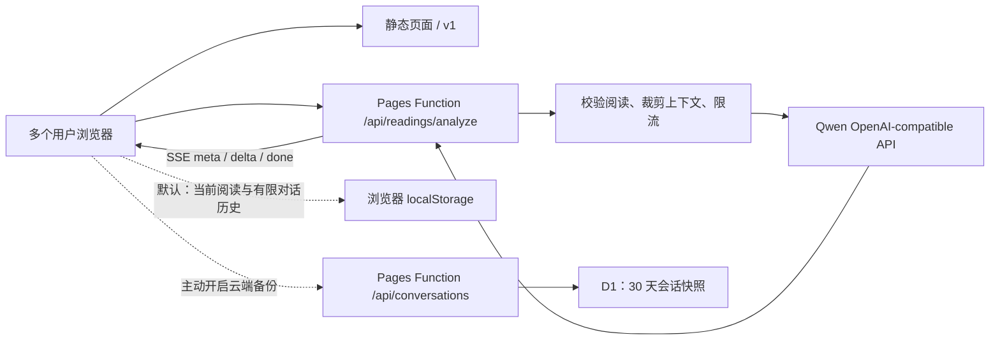

# LLM 交互、Prompt 与上线架构

- 状态：可选边翻边聊、逐张牌持久流式消息、有界多轮、改题路径与可选会话备份已实现
- 最近更新：2026-07-23
- 适用范围：MiaoTarot 的 Miao 语解读、后续追问、Qwen/百炼接入与 Cloudflare Pages 部署

## 结论

当前 GitHub + Cloudflare Pages 的模式可以支持多用户 LLM 交互。静态页面本身不持有 API Key；`functions/api/readings/analyze.js` 作为 Pages Function 在服务端校验请求、构造 prompt，再以 SSE 转发 Qwen 的增量响应。每个浏览器独立维护当前阅读与有限对话历史，刷新后可恢复；只有用户主动开启“云端备份”时，才把当前会话快照写入 D1。

最简单的上线形态是：

**GitHub/Vite 静态页面 + Cloudflare Pages Functions + Cloudflare Secret + Qwen OpenAI-compatible API + 可选 D1 会话备份**

D1 不是多轮上下文的必要条件；每次请求携带当前牌局和有界历史即可。D1 只承担用户明确选择的 30 天会话备份，且当前访问凭据仍保存在同一浏览器，因此不等于账号或跨设备同步。



Cloudflare 官方说明 Pages Functions 在 Workers 运行时执行服务端代码，不需要维护专用服务器；静态资源请求免费且不计入 Functions 请求，Functions 请求计入 Workers 配额。仓库通过 `_routes.json` 只让 `/api/*` 触发 Function，避免普通静态访问消耗 Functions 配额。

- [Cloudflare Pages Functions](https://developers.cloudflare.com/pages/functions/)
- [Pages Functions 路由](https://developers.cloudflare.com/pages/functions/routing/)
- [Pages Functions 定价](https://developers.cloudflare.com/pages/functions/pricing/)
- [Pages Secrets](https://developers.cloudflare.com/pages/functions/bindings/#secrets)

## 交互基准与采用结论

2026-07-23 核对了成熟产品与用户研究：

- [Labyrinthos 官方 Web 应用](https://app.labyrinthos.co/)把免费阅读、牌义学习和阅读记录作为基础能力，并把 personalized AI readings 明确标为 optional，同时强调针对 specific questions 的个性化解释。这支持 MiaoTarot “基础牌义不依赖 AI；用户开启后，问题成为逐张解释的全程锚点”。
- [Biddy Tarot 的提问指南](https://support.biddytarot.com/hc/en-us/articles/360001927456-How-to-Ask-More-Powerful-Questions-When-Reading-Tarot)强调清楚、具体、开放且赋能的问题比泛问或二元预测更有用。这支持在 AI 开关旁解释问题的重要性，并在改题时推荐重新抽牌。
- Fordham 的[塔罗实践心理学研究](https://research.library.fordham.edu/dissertations/AAI10838562/)发现求问者常寻求 validation、insight 和 playful experience，阅读过程从不确定走向较可理解的叙事；近期 [AI-assisted Tarot 研究](https://arxiv.org/abs/2602.11367)也把处理不确定与自我怀疑、探索替代视角列为常见用途。这支持“接住原话—提供牌面视角—把选择权还给用户”的情绪承接，但不支持给用户贴人格或心理标签。
- [ChatGPT 官方 FAQ](https://help.openai.com/en/articles/12677804-what-is-chatgpt-faq)明确说明同一 chat 内会记住上下文，用户选择 New chat 才重新开始；[未登录会话说明](https://help.openai.com/en/articles/9125172-the-chatgpt-home-page)则把会话限定在当前浏览器 session。这支持 MiaoTarot 把上下文绑定在当前阅读和当前页面，而不是跨问题、跨抽牌或跨设备隐式记忆。

因此复用现有 Mantine 表单、消息气泡、SSE 和 Pages Function，不引入另一套聊天框架：用户在抽牌前主动开启“和 Miao 边翻边聊”，每翻一张就向同一时间线追加“牌图 + 牌位 + 针对原问题的短解释”，用户不必等所有牌翻完即可追问。已经显示的 delta 立即成为持久消息；即使 provider 最终 JSON 不完整或流在尾部中断，文字也不会被清空。问题变化时默认推荐重新抽牌；用户仍可明确选择保留原牌，但旧 AI 对话会清空并按新问题重新解释。基础牌义与完整结果始终不依赖 AI。

## 本地验证结果

本机存在非空的 `DASHSCOPE_API_KEY`。测试没有输出或写入密钥，只把它在进程内映射为生产 Function 使用的 `LLM_API_KEY`。

真实测试通过 `functions/api/readings/analyze.js` 调用 Qwen，当前默认模型为 `qwen3.7-plus`，不是绕过服务端的裸 API demo。已验证：

1. 服务状态能识别 Qwen 配置。
2. 第一张牌翻开后即可通过 `card_reveal` 返回针对“这张牌 × 牌位 × 用户问题”的短消息；继续翻牌会逐张追加，不重新生成和替换整份报告。
3. 后续追问会继续使用同一次固定阅读和已生成的逐牌消息，不重抽或发明牌。
4. 后续能返回简短回答、可选的一个反思问题和最多 2 条行动。
5. 错误的历史角色顺序、过长历史和非法 mode 会在调用 provider 前被拒绝。
6. Qwen JSON mode、真实 SSE 增量和本地 mock Pages 路由都能通过；无效结构的尾包会返回 `done + incomplete`，前端保留可读内容并持久化。

2026-07-21 的代表性 smoke 使用了一个具体离职问题和五张“选择权衡”牌阵：继续留任并准备、三个月内离职、隐性成本、内在状态、建议。多次 `qwen-plus` 实测中，首轮约 2.7k–3.2k total tokens（输出约 580–720），追问约 2.5k–2.8k total tokens（输出约 115–165）；实际值会随问题、牌阵、提示词缓存和回答变化。五个牌位均按输入顺序逐一返回，整体解读能比较 A/B、引用“四个月存款”等已知约束，并把下一步收束到核算最低月支出和设置决策日期，没有替用户直接决定是否离职。

2026-07-23 的 `qwen3.7-plus` smoke 显式设置 `enable_thinking: false`，并在请求体设置 `stream: true`。首张牌解读收到 156 个 `delta`，首段约 844ms、总耗时约 10.0s；追问收到 31 个 `delta`，首段约 857ms、总耗时约 2.5s。结构化 JSON、有界追问和短文案契约均通过。Qwen Chat Completions 的 `stream` 默认是 `false`，所以“模型支持流式”不会自动让页面流式展示，客户端、Pages Function 和 provider 三层都必须显式启用并逐段消费；见[阿里云百炼流式输出说明](https://help.aliyun.com/zh/model-studio/stream)。

质量判断是：`qwen-plus` 与非思考模式的 `qwen3.7-plus` 都适合做“结构化逐牌解释 + 条件式权衡 + 把行动继续缩小”的交互；它们仍可能把财务行动写得比问题提供的信息更具体，因此这些内容只能作为待核实建议，不能当作事实。system prompt 已明确限制猫语密度、禁止补写用户未提供的事实、要求现实行动，并让 `reflectionQuestion` 默认返回 `null`。`smoke:qwen:local` 会打印五张逐牌解读，便于人工检查内容质量，而不只校验 JSON 结构。

测试命令：

```bash
npm run test:llm
npm run test:conversation-storage
npm run smoke:llm:local
npm run smoke:qwen:local
```

`smoke:qwen:local` 默认使用：

- Base URL：`https://dashscope.aliyuncs.com/compatible-mode/v1`
- Model：`qwen3.7-plus`
- Thinking：显式关闭（`enable_thinking: false`）
- JSON mode：`response_format: { "type": "json_object" }`
- 最大输出：1200 tokens
- 超时：30 秒

Qwen 官方支持 OpenAI-compatible Chat Completions 和 JSON object 输出；API Key 应保存在环境变量或服务端 Secret 中。

- [Qwen 首次 API 调用](https://help.aliyun.com/en/model-studio/first-api-call-to-qwen)
- [Qwen 结构化 JSON 输出](https://help.aliyun.com/en/model-studio/qwen-structured-output)

## 生产部署与验收

正式入口是 `https://tarot-31o.pages.dev`。Pages 项目 `tarot` 使用加密 Secret `LLM_API_KEY`、`qwen3.7-plus` 非思考模式和 D1 binding `MIAOTAROT_DB`。每次发布必须完成：

1. `verify:launch` 全量发布门禁与完整 Playwright 端到端套件全部通过。
2. `smoke:production` 验证当前构建、Pages Functions、生产 Qwen、D1 会话存储和静态资源。
3. `smoke:llm` 对正式域名发起真实首张牌与追问流式请求，两次结构化响应均通过共享契约。
4. `smoke:e2e:production` 在 `390×844` 手机视口从线上首页开始，翻开第一张牌后进入 Miao 语解读，验证流式首轮、追问、刷新恢复、显式云端备份与删除。截图写入 `artifacts/production-miao-streaming-conversation-2026-07-23.png`。
5. `320px` 本地端到端用例验证 AI 未配置时不发起 AI 请求，用户仍能完成抽牌和基础解读。

生产复验命令：

```bash
TAROT_PRODUCTION_ORIGIN=https://tarot-31o.pages.dev TAROT_REQUIRE_LLM=1 TAROT_REQUIRE_COUNTER=1 TAROT_REQUIRE_CONVERSATION_STORAGE=1 npm run smoke:production
TAROT_LLM_ENDPOINT=https://tarot-31o.pages.dev/api/readings/analyze npm run smoke:llm
TAROT_PRODUCTION_ORIGIN=https://tarot-31o.pages.dev npm run smoke:e2e:production
```

## 应该给 LLM 什么信息

LLM 不参与抽牌。浏览器先确定整副牌、顺序、正逆位和牌阵；第一张牌翻开后，只发送已经翻开的牌和 `{ revealedCards, totalCards, complete }` 进度。Function 校验后只把当前轮次解释所需的最小上下文交给 provider，隐藏牌不会发送。

### 必需信息

- 用户主动写下的问题；没有问题时使用明确的默认问题。
- 主题，例如开放问题、关系或工作。
- 牌阵名称与每个位置的角色。
- 每张牌的标准名称、关键词和正逆位。
- 传统牌义、牌位含义、结合主题后的含义。
- 猫牌名称、短 caption 和已经审核过的猫语含义。
- 一个来自内容层的低风险小行动，供模型参考而不是照抄。

### 不发送给 provider

- provider API Key。
- 浏览器匿名 id、reading id、IP、账号、设备信息或产品分析标识。
- 支持/付款状态。
- 其他阅读历史或与当前问题无关的聊天。
- 原始图片、图片 URL、品种、性别、姿势和未使用的视觉制作字段。
- 内部调研、debug prompt、生成图提示词或完整内容包。

前端 payload 可以包含用于服务端校验的更多字段，但 `buildModelContext` 会在调用 provider 前裁剪为最小上下文。用户只有主动开启“和 Miao 边翻边聊”、点击“开启 Miao 对话”或发送追问后，当前问题与已经翻开的牌才会发送给 AI 服务；产品分析仍然不记录这些内容。

## 首轮交互设计

首轮目标不是“再算一次”，而是把已经存在的牌义组织成一份更贴近当前问题的解释。

系统提示词必须守住：

- 当前牌、正逆位和牌阵位置是不可修改的事实。
- 只使用服务端校验过的阅读上下文。
- 先使用标准塔罗牌义，再结合牌位和用户的具体问题；猫语只是可选翻译，不能取代牌义。
- 严格按照输入顺序逐张解释，返回项数必须与抽到的牌数完全一致，不合并或漏掉牌位。
- 使用“可能、现在更像、可以观察或尝试”，不断言未来或他人内心。
- 区分“用户已提供的事实”和“根据牌义提出的假设”，不擅自补写时间、收入、存款、关系、健康、工作或第三方动机。
- 不替代医疗、法律、财务或危机支持。
- 不使用猫的品种、性别、习性或图片细节推导牌义。
- 猫咪比喻每段最多一句；行动必须从内容层的小行动和当前问题推导，不要求喝水、深呼吸、看窗外、散步、照顾植物、模仿猫、抚摸身体或进行与问题无关的想象仪式。
- 不用“你不是 A，而是 B”“并非 A，而是 B”这类排他转折替用户定义感受；保持用户原话的范围和强度，不把“目前没有”扩写成“害怕永远没有”。描述内在状态时使用“可能、提示、值得核实”，不用“确认、证明”把牌义包装成心理事实。
- 猫咪比喻不能引入比用户原话更强的负面评价或因果结论；它只能帮助理解前面已经讲清的标准牌义。
- “例如/比如”同样不能成为补造事实的后门：金额、时限、岗位反馈、第三方行为、身体症状和健康指标只有在输入上下文已经出现时才能引用；否则把它留成由用户填写的条件。
- 每张 `reading` 使用固定三步：传统牌义 → 牌位与用户原话 → 轻微改写该牌已有的 `tinyAction`。最后一步不新增括号、数字、指标或例子；summary 只综合逐牌内容，不另造行动或事实。
- 不暗示付费、继续追问或再抽一次会获得更准的结果。
- 不诱导用户通过连续占卜获得确定感。
- 用户可能带着不确定、反复权衡、想被理解、想获得许可感或想换一个视角而来；这些只能指导回应方式，不能被写成用户的性格或诊断。
- 情绪价值使用固定顺序：接住用户已经说出的在意或两难 → 给出这张牌能照亮的视角 → 把核实、选择和行动空间还给用户。
- 不空泛承诺“一切会好”，不给“敏感、缺爱、焦虑型、讨好型、回避型”等标签，不借亲密称呼制造依赖。

首轮严格返回：

```json
{
  "title": "短标题",
  "summary": "不超过 180 个中文字符的整体解释",
  "cards": [
    { "position": "牌位", "reading": "不超过 150 个中文字符的逐牌依据" }
  ],
  "actions": ["动作一", "动作二", "动作三"],
  "shareText": "分享短句"
}
```

当前 MiaoTarot 支持 1、2、3、4、5 张阅读。五张牌有两个明确用途：

- **选择权衡**：方案 A、方案 B、隐性成本、内在状态、建议。问题已经写明 A/B 时沿用原文；没有写明时才暂定 A 为维持现状、B 为主动改变，并在回答中明确这是假设。可以给出带条件的倾向，但不能替用户拍板；优先指出信息缺口、可逆准备和切换条件。
- **关系剖面**：自己、对方、关系现状、阻碍、建议。不能把牌义当作读心证据，不断言对方未表达的动机或感受。

一至四张牌继续使用各自固定牌位，不因为问题具体就擅自增加、减少或重抽牌。用户问“要不要离职”“要不要搬家”等二选一问题时，前端默认推荐五张“选择权衡”，让模型真正比较两条路径，而不是用泛化三张牌给一个模糊结论。

## 多轮交互设计

多轮不是无限聊天，而是围绕同一份阅读做三类事情：

1. 澄清某张牌或某个牌位。
2. 比较两个可行视角，但不替用户决定；选择权衡牌阵必须继续保留 A/B、隐性成本与决策条件。
3. 把建议缩小成今天可以完成的一步。

推荐 UI：开启 AI 后，第一张牌翻开即进入“Miao 语解读（可选）”，每张牌以独立消息显示牌图、牌位和短解释；后续牌只追加消息，不重置已完成内容，也不显示“重新生成精简解读”。首张牌之后就提供两个情境化快捷追问和输入框。每次只发送当前可见阅读、逐牌消息摘要、最近有限追问和本轮问题；新牌局使用新的对话。问题可以修改，但界面先推荐“用新问题重新抽牌”；选择保留牌面时必须清空旧 AI 内容再重新解释。

服务端接受的历史有明确上限：最多 11 条、总长度最多 12000 字符，必须从 assistant 开始并按 assistant/user 交替，当前用户问题单独传入。11 条历史对应首轮 assistant 结果加最多 5 组已完成的 user/assistant 追问，足以在第 6 次追问时保留完整会话。历史由客户端提交但始终视为不可信输入，不能覆盖 system prompt。

后续严格返回：

```json
{
  "reply": "直接回应本轮问题，并连回当前牌位和传统牌义",
  "reflectionQuestion": "默认 null；用户明确想继续探索且确实有帮助时最多一个",
  "actions": ["最多两条小行动"]
}
```

追问的回答和行动只能引用当前上下文已有的数字、条件和 `tinyAction`；不得为了显得具体而新增阈值、比例、日期、公式、身体指标或假设例子。具体不是“替用户编一个数字”，而是把已有行动缩小到最先核实的一项。

如果用户提出与当前阅读无关的新问题，模型应建议开始一份新阅读，而不是把旧牌强行套用。问题已经足够清楚时，应帮助用户收束并自然结束，不为了延长对话继续提问。

## 多用户能力与限制

### 当前已经支持

- 多个用户可以同时加载静态页面并调用同一个 Pages Function。
- Function 自动横向扩展，不需要单独的 Node 服务器。
- API Key 只存在 Cloudflare Secret，不会进入 GitHub、Vite bundle 或浏览器。
- 无状态多轮通过“每次请求携带有限历史”完成，不会串会话。
- 当前牌局、逐张牌消息、流式中的已到达文字、追问和草稿默认保存在浏览器；刷新可恢复，最多保留最近 8 份、每份最多 6 轮。
- 云端备份默认关闭；开启后通过随机 conversation id 和 256-bit access key 访问，服务端只保存 key 的 SHA-256，30 天过期，并支持显式删除。
- 静态页面即使 AI provider 暂时不可用，仍能完成抽牌、基础解释和分享。

### 当前还不能声称已解决

- 当前内存 `Map` 限流只在单个 isolate 内有效，不是跨全球节点的严格限流。
- 前端还没有接入 Turnstile token 获取流程；如果线上设置 Turnstile Secret，现有 UI 会把 AI 标为暂不可用。
- 对话没有账号与跨设备恢复；云端凭据仍保存在当前浏览器，这是有意的隐私边界。

公开测试阶段可以先依赖精确同源 CORS、请求体上限、provider 预算、输出上限和基础限流。面向不可控的大规模公开流量前，应接入 Turnstile 或 Cloudflare 的全局限流能力，避免 Key 被公共 API 消耗。

## 最简单的上线步骤

仓库已经具备 Pages Functions、D1 迁移和部署脚本，不需要迁移到传统服务器。

1. 登录 Cloudflare：

   ```bash
   npx wrangler login
   npx wrangler whoami
   ```

2. 创建 D1、写入 `wrangler.jsonc` 的 `MIAOTAROT_DB` binding，并执行迁移：

   ```bash
   npm run counter:db:create
   npm run counter:db:migrate
   ```

3. 在 Cloudflare Pages 项目中把本地 `DASHSCOPE_API_KEY` 的值设置为加密 Secret `LLM_API_KEY`：

   ```bash
   npm run secret:llm
   ```

4. 在 Pages 项目的 Variables and Secrets 中设置普通变量：

   ```text
   LLM_BASE_URL=https://dashscope.aliyuncs.com/compatible-mode/v1
   LLM_MODEL=qwen3.7-plus
   LLM_ENABLE_THINKING=false
   LLM_JSON_MODE=true
   LLM_MAX_TOKENS=1200
   LLM_TIMEOUT_MS=30000
   LLM_RATE_LIMIT_PER_MINUTE=12
   LLM_ALLOWED_ORIGINS=https://你的正式域名
   ```

5. 完整验证并通过 Wrangler 直接发布：

   ```bash
   npm run verify:launch
   npm run deploy
   ```

6. 发布后验证真实 provider：

   ```bash
   TAROT_LLM_ENDPOINT="https://你的正式域名/api/readings/analyze" npm run smoke:llm
   ```

这条路径是当前仓库最少改动的上线方案。GitHub 自动部署可以随后接入，但它只改变发布触发方式，不改变多用户交互架构；Pages Function、Secret 和 Qwen provider 仍然相同。

## 后续扩展触发条件

- 需要刷新后恢复当前对话：使用现有浏览器存储，不需要云端。
- 需要临时服务器备份：由用户显式开启现有 D1 备份，30 天后过期。
- 需要跨设备历史或登录：增加身份系统，让 D1 会话按账号隔离；现有随机凭据方案不承担账号能力。
- 需要可靠的全局限流：接入 Turnstile、Cloudflare Rate Limiting 或 Durable Object，不依赖 isolate 内存。
- 需要更低成本：用同一套 smoke 对比 `qwen-flash`，在质量达标后再换模型。
- 需要长期个性化：只保存用户明确选择保留的摘要，不默认保存原始敏感问题或完整聊天。
