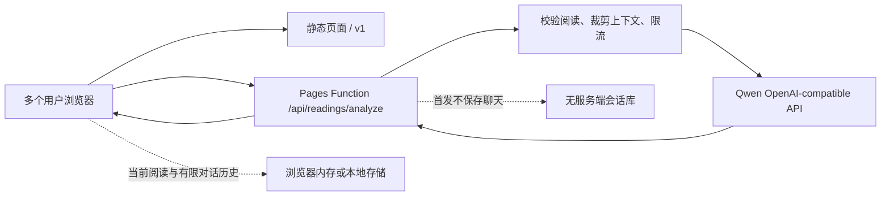

# LLM 交互、Prompt 与上线架构

- 状态：首轮解读与有界多轮契约已实现，本地 Qwen 实测通过
- 最近更新：2026-07-21
- 适用范围：MiaoTarot 的 AI 猫语解读、后续追问、Qwen/百炼接入与 Cloudflare Pages 部署

## 结论

当前 GitHub + Cloudflare Pages 的模式可以支持多用户 LLM 交互。静态页面本身不持有 API Key；`functions/api/readings/analyze.js` 作为 Pages Function 在服务端校验请求、构造 prompt，再调用 Qwen。每个浏览器独立维护当前阅读与有限对话历史，Function 保持无状态，因此不需要常驻服务器，也不需要为了第一版对话引入数据库。

最简单的上线形态是：

**GitHub/Vite 静态页面 + Cloudflare Pages Functions + Cloudflare Secret + Qwen OpenAI-compatible API**

D1 不是首发多轮对话的必要条件。只有需要登录、跨设备恢复、服务端会话记录或长期个性化时，才增加 D1 与身份系统。



Cloudflare 官方说明 Pages Functions 在 Workers 运行时执行服务端代码，不需要维护专用服务器；静态资源请求免费且不计入 Functions 请求，Functions 请求计入 Workers 配额。仓库通过 `_routes.json` 只让 `/api/*` 触发 Function，避免普通静态访问消耗 Functions 配额。

- [Cloudflare Pages Functions](https://developers.cloudflare.com/pages/functions/)
- [Pages Functions 路由](https://developers.cloudflare.com/pages/functions/routing/)
- [Pages Functions 定价](https://developers.cloudflare.com/pages/functions/pricing/)
- [Pages Secrets](https://developers.cloudflare.com/pages/functions/bindings/#secrets)

## 本地验证结果

本机存在非空的 `DASHSCOPE_API_KEY`。测试没有输出或写入密钥，只把它在进程内映射为生产 Function 使用的 `LLM_API_KEY`。

真实测试通过 `functions/api/readings/analyze.js` 调用 `qwen-plus`，不是绕过服务端的裸 API demo。已验证：

1. 服务状态能识别 Qwen 配置。
2. 首轮能返回符合共享契约的标题、摘要、逐牌解释、3 条行动和分享文案；服务端会拒绝缺牌、合并牌位或调换牌位的结果。
3. 后续追问会继续使用同一次固定阅读，不重抽或发明牌。
4. 后续能返回简短回答、可选的一个反思问题和最多 2 条行动。
5. 错误的历史角色顺序、过长历史和非法 mode 会在调用 provider 前被拒绝。
6. Qwen JSON mode 与本地 mock Pages 路由都能通过。

2026-07-21 的代表性 smoke 使用了一个具体离职问题和五张“选择权衡”牌阵：继续留任并准备、三个月内离职、隐性成本、内在状态、建议。多次 `qwen-plus` 实测中，首轮约 2.7k–3.2k total tokens（输出约 580–720），追问约 2.5k–2.8k total tokens（输出约 115–165）；实际值会随问题、牌阵、提示词缓存和回答变化。五个牌位均按输入顺序逐一返回，整体解读能比较 A/B、引用“四个月存款”等已知约束，并把下一步收束到核算最低月支出和设置决策日期，没有替用户直接决定是否离职。

质量判断是：`qwen-plus` 适合做“结构化逐牌解释 + 条件式权衡 + 把行动继续缩小”的交互；它仍可能把财务行动写得比问题提供的信息更具体，因此这些内容只能作为待核实建议，不能当作事实。system prompt 已明确限制猫语密度、禁止补写用户未提供的事实、要求现实行动，并让 `reflectionQuestion` 默认返回 `null`。`smoke:qwen:local` 会打印五张逐牌解读，便于人工检查内容质量，而不只校验 JSON 结构。

测试命令：

```bash
npm run test:llm
npm run smoke:llm:local
npm run smoke:qwen:local
```

`smoke:qwen:local` 默认使用：

- Base URL：`https://dashscope.aliyuncs.com/compatible-mode/v1`
- Model：`qwen-plus`
- JSON mode：`response_format: { "type": "json_object" }`
- 最大输出：1200 tokens
- 超时：30 秒

Qwen 官方支持 OpenAI-compatible Chat Completions 和 JSON object 输出；API Key 应保存在环境变量或服务端 Secret 中。

- [Qwen 首次 API 调用](https://help.aliyun.com/en/model-studio/first-api-call-to-qwen)
- [Qwen 结构化 JSON 输出](https://help.aliyun.com/en/model-studio/qwen-structured-output)

## 应该给 LLM 什么信息

LLM 不参与抽牌。浏览器先确定牌、顺序、正逆位和牌阵，Function 校验后只把完成解释所需的最小上下文交给 provider。

### 必需信息

- 用户主动写下的问题；没有问题时使用明确的默认问题。
- 主题，例如开放问题、关系或工作。
- 牌阵名称与每个位置的角色。
- 每张牌的标准名称、关键词和正逆位。
- 传统牌义、牌位含义、结合主题后的含义。
- 猫牌名称、短 caption 和已经审核过的猫语含义。
- 一个来自内容层的低风险小行动，供模型参考而不是照抄。

### 不发送给 provider

- provider API Key。
- 浏览器匿名 id、reading id、IP、账号、设备信息或产品分析标识。
- 支持/付款状态。
- 其他阅读历史或与当前问题无关的聊天。
- 原始图片、图片 URL、品种、性别、姿势和未使用的视觉制作字段。
- 内部调研、debug prompt、生成图提示词或完整内容包。

前端 payload 可以包含用于服务端校验的更多字段，但 `buildModelContext` 会在调用 provider 前裁剪为最小上下文。用户只有主动点击“生成 AI 猫语解读”时，当前问题与阅读上下文才会发送给 AI 服务；产品分析仍然不记录这些内容。

## 首轮交互设计

首轮目标不是“再算一次”，而是把已经存在的牌义组织成一份更贴近当前问题的解释。

系统提示词必须守住：

- 当前牌、正逆位和牌阵位置是不可修改的事实。
- 只使用服务端校验过的阅读上下文。
- 先使用标准塔罗牌义，再结合牌位和用户的具体问题；猫语只是可选翻译，不能取代牌义。
- 严格按照输入顺序逐张解释，返回项数必须与抽到的牌数完全一致，不合并或漏掉牌位。
- 使用“可能、现在更像、可以观察或尝试”，不断言未来或他人内心。
- 区分“用户已提供的事实”和“根据牌义提出的假设”，不擅自补写时间、收入、存款、关系、健康、工作或第三方动机。
- 不替代医疗、法律、财务或危机支持。
- 不使用猫的品种、性别、习性或图片细节推导牌义。
- 猫咪比喻每段最多一句；行动必须从内容层的小行动和当前问题推导，不要求喝水、深呼吸、看窗外、散步、照顾植物、模仿猫、抚摸身体或进行与问题无关的想象仪式。
- 不用“你不是 A，而是 B”“并非 A，而是 B”这类排他转折替用户定义感受；保持用户原话的范围和强度，不把“目前没有”扩写成“害怕永远没有”。描述内在状态时使用“可能、提示、值得核实”，不用“确认、证明”把牌义包装成心理事实。
- 猫咪比喻不能引入比用户原话更强的负面评价或因果结论；它只能帮助理解前面已经讲清的标准牌义。
- “例如/比如”同样不能成为补造事实的后门：金额、时限、岗位反馈、第三方行为、身体症状和健康指标只有在输入上下文已经出现时才能引用；否则把它留成由用户填写的条件。
- 每张 `reading` 使用固定三步：传统牌义 → 牌位与用户原话 → 轻微改写该牌已有的 `tinyAction`。最后一步不新增括号、数字、指标或例子；summary 只综合逐牌内容，不另造行动或事实。
- 不暗示付费、继续追问或再抽一次会获得更准的结果。
- 不诱导用户通过连续占卜获得确定感。

首轮严格返回：

```json
{
  "title": "短标题",
  "summary": "1-3 张牌用 2-3 句；4-5 张牌用 3-5 句整体解释",
  "cards": [
    { "position": "牌位", "reading": "传统牌义 + 当前问题 + 必要的猫语翻译" }
  ],
  "actions": ["动作一", "动作二", "动作三"],
  "shareText": "分享短句"
}
```

当前 MiaoTarot 支持 1、2、3、4、5 张阅读。五张牌有两个明确用途：

- **选择权衡**：方案 A、方案 B、隐性成本、内在状态、建议。问题已经写明 A/B 时沿用原文；没有写明时才暂定 A 为维持现状、B 为主动改变，并在回答中明确这是假设。可以给出带条件的倾向，但不能替用户拍板；优先指出信息缺口、可逆准备和切换条件。
- **关系剖面**：自己、对方、关系现状、阻碍、建议。不能把牌义当作读心证据，不断言对方未表达的动机或感受。

一至四张牌继续使用各自固定牌位，不因为问题具体就擅自增加、减少或重抽牌。用户问“要不要离职”“要不要搬家”等二选一问题时，前端默认推荐五张“选择权衡”，让模型真正比较两条路径，而不是用泛化三张牌给一个模糊结论。

## 多轮交互设计

多轮不是无限聊天，而是围绕同一份阅读做三类事情：

1. 澄清某张牌或某个牌位。
2. 比较两个可行视角，但不替用户决定；选择权衡牌阵必须继续保留 A/B、隐性成本与决策条件。
3. 把建议缩小成今天可以完成的一步。

推荐 UI：首轮结果后提供两个情境化快捷追问和一个可选输入框，例如“这张牌最值得我注意什么？”、“把行动再缩小一点”。每次只发送当前阅读、最近有限消息和本轮问题；新抽牌后立即清空旧对话。产品层建议每份阅读最多开放 3 次追问，避免把体验做成依赖性聊天机器人。

服务端接受的历史有明确上限：最多 7 条、总长度最多 12000 字符，必须从 assistant 开始并按 assistant/user 交替，当前用户问题单独传入。历史由客户端提交但始终视为不可信输入，不能覆盖 system prompt。

后续严格返回：

```json
{
  "reply": "直接回应本轮问题，并连回当前牌位和传统牌义",
  "reflectionQuestion": "默认 null；用户明确想继续探索且确实有帮助时最多一个",
  "actions": ["最多两条小行动"]
}
```

追问的回答和行动只能引用当前上下文已有的数字、条件和 `tinyAction`；不得为了显得具体而新增阈值、比例、日期、公式、身体指标或假设例子。具体不是“替用户编一个数字”，而是把已有行动缩小到最先核实的一项。

如果用户提出与当前阅读无关的新问题，模型应建议开始一份新阅读，而不是把旧牌强行套用。问题已经足够清楚时，应帮助用户收束并自然结束，不为了延长对话继续提问。

## 多用户能力与限制

### 当前已经支持

- 多个用户可以同时加载静态页面并调用同一个 Pages Function。
- Function 自动横向扩展，不需要单独的 Node 服务器。
- API Key 只存在 Cloudflare Secret，不会进入 GitHub、Vite bundle 或浏览器。
- 无状态多轮通过“每次请求携带有限历史”完成，不会串会话。
- 静态页面即使 AI provider 暂时不可用，仍能完成抽牌、基础解释和分享。

### 当前还不能声称已解决

- 本机 Wrangler 尚未登录，因此无法确认线上 Pages 项目是否已经配置 `LLM_API_KEY` 和其他变量。
- 当前内存 `Map` 限流只在单个 isolate 内有效，不是跨全球节点的严格限流。
- 前端还没有接入 Turnstile token 获取流程；如果线上设置 Turnstile Secret，现有 UI 会把 AI 标为暂不可用。
- 对话没有账号与跨设备恢复；这是首发的有意取舍，不是静态架构缺陷。

公开测试阶段可以先依赖精确同源 CORS、请求体上限、provider 预算、输出上限和基础限流。面向不可控的大规模公开流量前，应接入 Turnstile 或 Cloudflare 的全局限流能力，避免 Key 被公共 API 消耗。

## 最简单的上线步骤

仓库已经具备 Pages Functions 和部署脚本，不需要迁移到传统服务器，也不需要先建 D1 会话表。

1. 登录 Cloudflare：

   ```bash
   npx wrangler login
   npx wrangler whoami
   ```

2. 在 Cloudflare Pages 项目中把本地 `DASHSCOPE_API_KEY` 的值设置为加密 Secret `LLM_API_KEY`：

   ```bash
   npm run secret:llm
   ```

3. 在 Pages 项目的 Variables and Secrets 中设置普通变量：

   ```text
   LLM_BASE_URL=https://dashscope.aliyuncs.com/compatible-mode/v1
   LLM_MODEL=qwen-plus
   LLM_JSON_MODE=true
   LLM_MAX_TOKENS=1200
   LLM_TIMEOUT_MS=30000
   LLM_RATE_LIMIT_PER_MINUTE=12
   LLM_ALLOWED_ORIGINS=https://你的正式域名
   ```

4. 完整验证并通过 Wrangler 直接发布：

   ```bash
   npm run verify:launch
   npm run deploy
   ```

5. 发布后验证真实 provider：

   ```bash
   TAROT_LLM_ENDPOINT="https://你的正式域名/api/readings/analyze" npm run smoke:llm
   ```

这条路径是当前仓库最少改动的上线方案。GitHub 自动部署可以随后接入，但它只改变发布触发方式，不改变多用户交互架构；Pages Function、Secret 和 Qwen provider 仍然相同。

## 后续扩展触发条件

- 需要刷新后恢复当前对话：先存浏览器本地，不上 D1。
- 需要跨设备历史或登录：增加身份系统和 D1，会话按用户隔离。
- 需要可靠的全局限流：接入 Turnstile、Cloudflare Rate Limiting 或 Durable Object，不依赖 isolate 内存。
- 需要更低成本：用同一套 smoke 对比 `qwen-flash`，在质量达标后再换模型。
- 需要长期个性化：只保存用户明确选择保留的摘要，不默认保存原始敏感问题或完整聊天。
