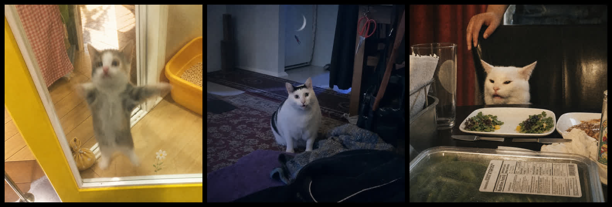
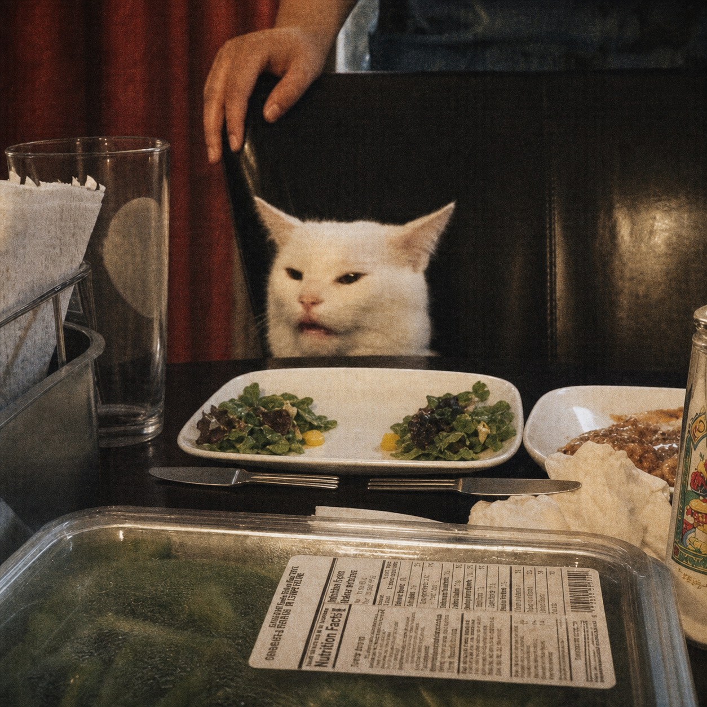
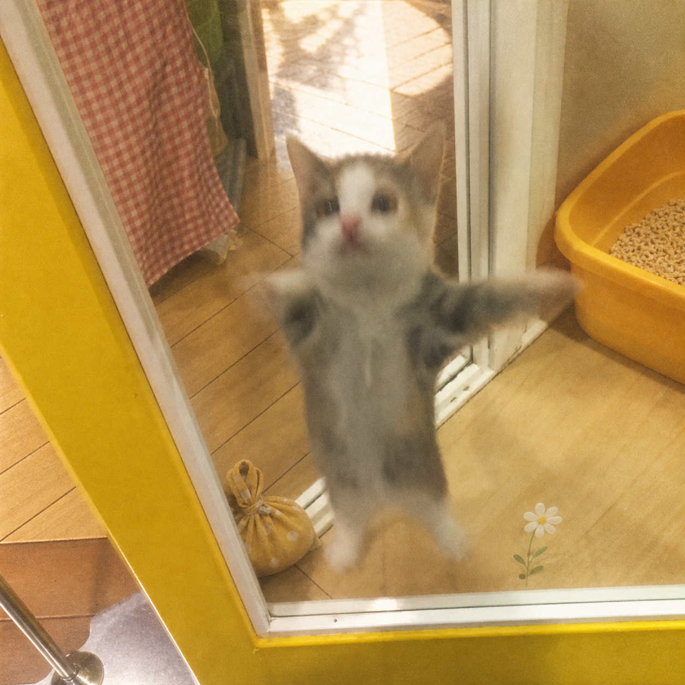
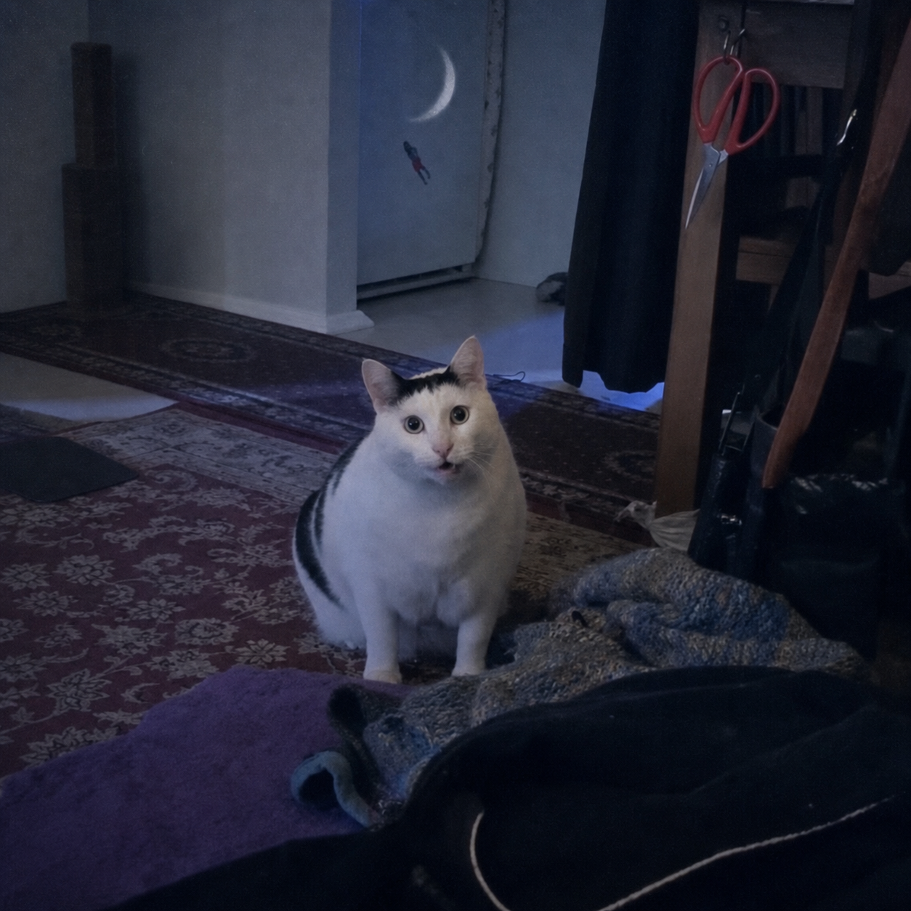

# MiaoTarot Famous-Meme Calibration

Date: 2026-07-16

## Purpose

This pass answers a different question from the openly licensed cat-photo batch:
can MiaoTarot preserve a famous meme mother image strongly enough that recognition
survives the Tarot layer?

All three inputs are `research-only`. They are cached locally by
`npm run fetch:famous-memes` and are not committed or copied into public assets.
The outputs below are review artifacts, not licensed production cards.

Contact-sheet order: Happy Cat / The Fool, Huh Cat / The Moon, Smudge / Justice.

## Smudge / Justice

| Mother image | Light wash |
| --- | --- |
| Local cache: `smudge-dinner-original.jpg` from the [original Tumblr post](https://www.tumblr.com/deadbeforedeath/175034192749/he-no-like-vegetals) |  |

- Meme recognition: strong. Face, chair, plate, table, glass, hand, and awkward
  dinner snapshot remain the first read.
- Tarot meaning: strong but restrained. The two equal salad groups and horizontal
  cutlery communicate balance without turning the scene into fantasy art.
- Identity drift: low. Fur/face texture is repainted, but the expression and scene
  identity remain specific to Smudge.
- Revision: crop or mask the foreground nutrition label in a deterministic pass;
  generative editing tried to retain and partially rewrite source text.

## Happy Happy Happy Cat / The Fool

| Mother frame | Light wash |
| --- | --- |
| Local frame at 5 seconds from the [original 2015 post](https://twitter.com/1Nssu/status/663271961917652993) |  |

- Meme recognition: very strong. The jumping body, spread paws, face blur, glass,
  yellow frame, and litter tray survive.
- Tarot meaning: strong. The door is already a Fool threshold; flower and bundle
  can stay tiny.
- Identity drift: low-medium. The face was clarified slightly, but the original
  blur and unpolished video-frame energy remain.
- Revision: shrink the bundle by roughly one third; it currently competes with
  the meme action more than necessary.

## Huh? Cat / The Moon

| Owner-posted frame | Light wash |
| --- | --- |
| Local frame at 18 seconds from the [owner repost](https://www.tiktok.com/@planetvenus500/video/7199466399817813250) |  |

- Meme recognition: strong for viewers who know Ben Cat. The cap marking, round
  body, round eyes, and open mouth survive.
- Tarot meaning: medium-strong. Cool light and crescent reflection read as Moon;
  the room stays ordinary and uncertain.
- Identity drift: low. The model mostly cleaned social overlays and re-lit the
  existing scene.
- Revision: source quality is weaker because this is an owner repost with social
  overlays, not the deleted clean 2021 upload. Continue searching or request the
  clean clip from the owner before production.

## Verdict

The prompt formula works when it names source invariants before style and sets an
explicit edit budget. The winning product style is not a full redraw. It is a
recognizable source photograph or video frame with restrained editorial grading,
small scene-native Tarot deltas, and selective cleanup.

The public 22-card art should not be replaced in bulk yet. First obtain permission
for at least five first-tier meme families, then repeat this exact source/output
review. A technically attractive image without rights clearance stays in docs.
